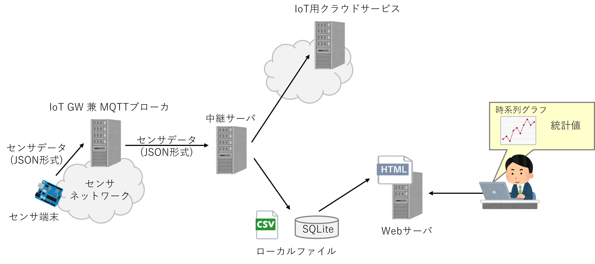

# mqtt_sensor_watch

システム全体の構成は以下の図のようになっており，MQTTブローカからセンサデータを取得し，クラウドサービスにアップロードする
プログラムと，取得したデータをローカルに保存し，保存したデータを加工/可視化するプログラムに分かれる．

## 1. クラウドアップロード用プログラム
データのアップロード先として利用できるクラウドサービスは以下の3種類である．

- Anbient IoT : https://ambidata.io/
- Googleスプレッドシート : https://www.google.com/intl/ja/sheets/about/
- Arduinoクラウド : https://cloud.arduino.cc/

それぞれのサービスに対応したデータ中継用プログラムは以下の通り．各プログラムの詳細は，リンクを辿っていただきたい．

- [mqttToAnbient](mqttToAnbient.md)
- [mqttToArduino](mqttToArduino.md)
- [mqttToGoogleSP](mqttToGoogleSP.md)

上記3つのプログラム用の入力/設定ファイルを対話的に作成するアプリも用意されている．

- [defineMqttToCloud](defineMqttToCloud.md)

## 2. ローカル処理用プログラム

この環境は以下の4種類(6つ)のプログラムから成り立っており，データ抽出以外のプログラムの関係は下の図のような構造になっている．
各プログラムの詳細は，リンクを辿っていただきたい．

- MQTTブローカからのデータ取得
  - [mqttListner](mqttListner.md)

- ファイル形式変換
  - [csv_to_sqlite](csv_to_sqlite.md)
  - [sqlite_to_csv](sqlite_to_csv.md)

- 可視化Webページ生成
  - [defineSensorViewer](defineSensorViewer.md)
  - [genSensorViewer](genSensorViewer.md)

- データ抽出
  - [dataFilter](dataFilter.md)

### データ抽出
6つのプログラムのうち，データ抽出(dataFilter)は，mqttListnerが取得したデータの中から特定の時刻のデータを抽出するために用いる．

dataFilterの動きを表したものが下の図である．

例えば，毎分観測している温度と湿度のデータがあり，2つのセンサの測定時間が微妙にずれているとする．
このようなデータ系列がある場合に，毎日特定の時刻(上図では12時)のデータを抽出する場合に，決められた時刻
から許容範囲の時刻に測定されたデータを規定の時刻のデータのペアとして抽出する動きをする．

この機能を利用して，特定の時刻のデータの分析を各系列に対して行う場合や，上図の場合，温度と湿度の関係を分析する場合に用いる．

