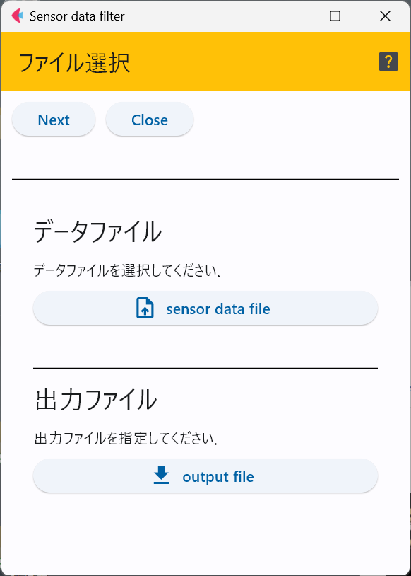
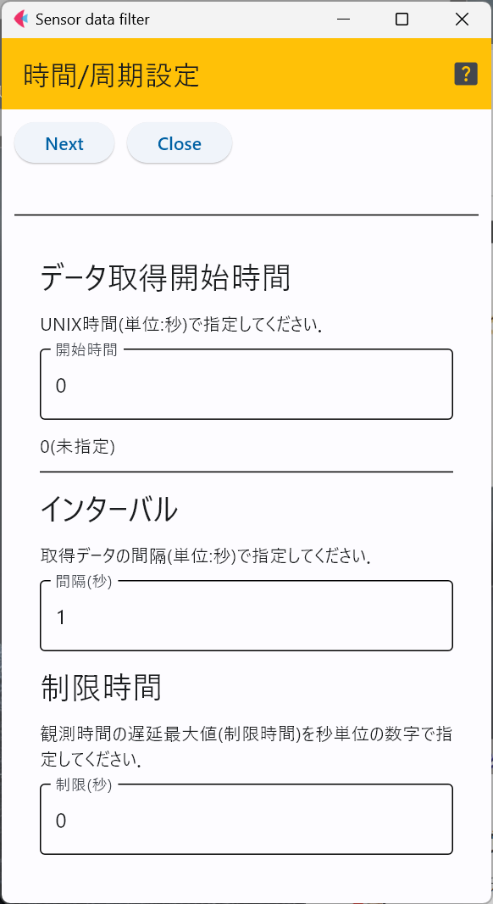
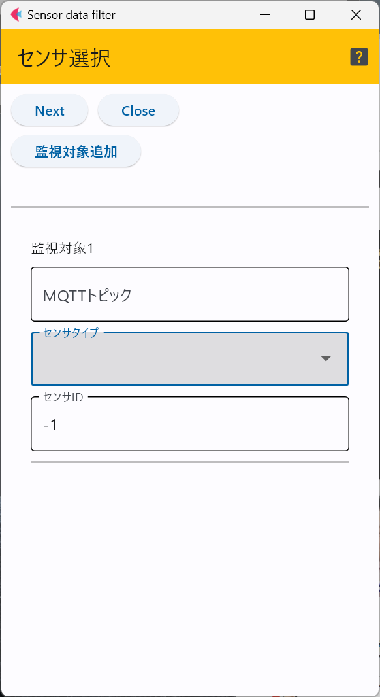
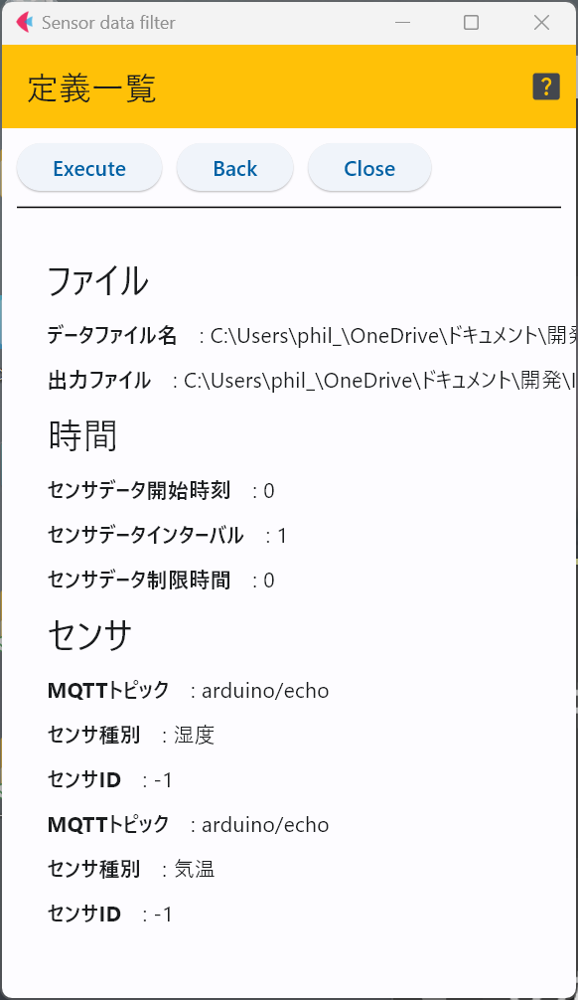

# dataFilter

## ファイルの選択
観測したデータが格納されているファイルと出力ファイルを選択する．

目的のファイルを選択後に「Next」ボタンを押す．

## 時間の指定
抽出する観測データの時間に関するパラメータを指定する．

例えば，毎日12:00のデータを欲しい場合，初回データが何年何月何日の12時になるかを
考え，その値をUNIX時間(1977/1/1の0時を0として，何秒経過したかで時刻を表す方式)で
入力する．

次に，毎日なので，1日を秒に変換して2番目の欄に入力する．

12時のデータが欲しい場合に，センサがその時刻で測定しているとは限らない．
そのため，何秒後までの測定データであれば，指定時刻のデータとして採用して良いかを示すのが
3つ目のパラメータである．

3つのパラメータを入力した後，「Next」ボタンをクリックする．

## センサ選択
入力ファイルには，目的とするセンサのデータ以外も含まれる可能性がある．
そのため，必要なセンサの種類やMQTTトピックを指定する．

なお，センサIDは-1を選択した場合，センサIDは無視して抽出処理を行う．

## 定義の確認
この画面では，定義した各パラメータが表示されているので，問題がなければ「Execute」ボタンをクリックして
データ抽出を行う．

***
- [READMEに戻る](README.md)

