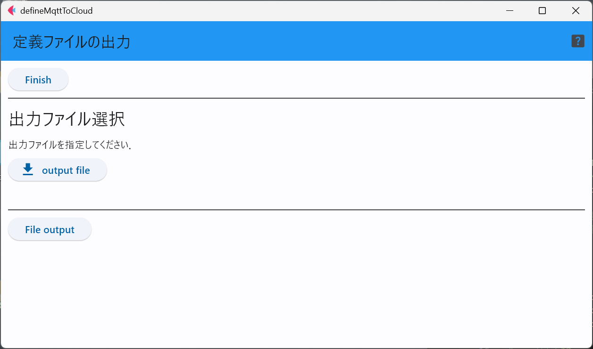

# defineMqttToCloud

このソフトは，MQTTで取得したデータをクラウドサービスに中継するための以下の3種類のソフトウェア用の定義ファイルを作るためのものである．

- [mqttToAnbient](mqttToAnbient.md)
- [mqttToArduino](mqttToArduino.md)
- [mqttToGoogleSP](mqttToGoogleSP.md)

各クラウドサービス専用のパラメータの入力を行う必要があるが，これらのクラウドサービス専用のパラメータについては，各クラウドサービス用
データ転送プログラムのマニュアルを参照してください．

## 1. MQTTブローカ関連パラメータ
この画面では，MQTTブローカのIPアドレスやポート番号に加えて，MQTTブローカから取得するセンサデータ全体に共通するMQTTのトピックと通信タイムアウト時間，認証を使うか否かを設定する．

認証を用いる場合のみ，この画面が表示されるので，認証のユーザ名とパスフレーズを入力する．

## 2. クラウドサービス選択

ここでは，データをアップロードするクラウドサービスを選択する．

## 3. Anbient関連
Anbientにデータを送信(転送)する場合はここで，専用のパラメータを入力する．

### 3.1. 時刻情報
Anbientはデータに時刻情報を付加して送信する仕組みであるため，付加する時刻をセンサ端末による測定時刻か，実際に中継する際の時刻のいずれかを選択する．
ただし，測定時刻はセンサ端末のRTC(リアルタイムクロックIC)が正しい時刻に設定されており，バッテリバックアップされている等の条件を満たしている
必要がある．

### 3.2. アップロードデータ設定
Anbientでは，データをアップロードするために，Anbientのサイト上にチャンネルを作成する．このチャンネルには，番号と読み込み用，書き込み用(write key)など
多くのパスワードが生成される．

また，1つのチャンネルには``d1``から``d8``までの8個のラベルが利用可能であるため，MQTTのトピック，センサID，センサの種類のすべてが一致する
センサデータをどのチャンネルのどのラベルに対応させるかをこのページで定義する．
この時，センサIDに``-1``を入力すると，センサIDは無視する．

ただし，3軸加速度センサ等は複数のデータ(x軸,y軸,z軸)の組み合わせになるため，この場合は，データラベル欄に，「``d1,d2,d3``」のように
「``,``」区切りで並べて入力する．

### 3.3. 内容確認
ここまでの入力内容を確認し，問題が無ければ「Next」ボタンでファイルの出力に進む．

### 3.4. 設定ファイル出力
この画面では，出力するファイルをダイアログで選択し，「File output」ボタンで保存を実行する．

## 4. Arduino Cloud関連
クラウドサービスの選択で，Arduino Cloudを選択した場合は以下のようなメニューで必要な情報を入力する．

### 4.1. デバイスIDおよびkey
Arduino Cloudにアカウントを登録し，データをアップロードするデバイスやThingの定義を行う．
このデバイスのIDやキーの情報をここに入力する．

### 4.2. アップロードデータ選択
MQTTのトピックやセンサID, センサ種類を選択し，そのセンサデータに対応させるデータのラベルを定義する．このラベルは，クラウド上でThingを定義した際に，いくつかの変数(データラベル)を定義しているはずなので，そのラベルを「sensor data label」欄に入力する．

なお，センサの種類が3軸加速度センサや光センサのように，複数の値の組み合わせとなる場合は，データラベル欄に「``,``」区切りで複数のラベルを並べて記入する．

### 4.3. 内容確認とファイル出力
ここまでの入力内容を確認し，問題が無ければ「Next」ボタンでファイルの出力に進む．

ファイル出力画面では，出力するファイルをダイアログで選択し，「File output」ボタンで保存を実行する．

## 5. Google SpreadSheet関連
クラウドサービスの選択で，Google Spread Sheetを選択した場合は以下のようなメニューで必要な情報を入力する．

### 5.1. 時刻情報選択
Google SpreadSheetにデータをアップロードする場合，GAS(Google app script)との連携で時刻時刻をデータに付加することができるが，
この時刻情報として，センサ端末による測定時刻か，実際に中継する際の時刻のいずれかを選択する．
ただし，測定時刻はセンサ端末のRTC(リアルタイムクロックIC)が正しい時刻に設定されており，バッテリバックアップされている等の条件を満たしている
必要がある．

### 5.2. アップロードデータ設定
Google Spread Sheetにデータをアップロードするために，GASのプログラムをデプロイしたはずである．その際に生成されるデプロイIDを
Google Spread Sheetの画面で確認しておく．また，GASを定義する際に，データに付与するラベルも同時に定義したはずであるので，
そちらも確認してメモしておく．

この画面に戻り，センサデータをMQTTのトピック，センサID，センサの種類を選択し，このセンサのデータをアップロードする際に用いる
データラベル．アップロード先のGASのデプロイIDを記入する．

なお，センサの種類が3軸加速度センサや光センサのように，複数の値の組み合わせとなる場合は，データラベル欄に「``,``」区切りで複数のラベルを並べて記入する．

### 5.3. 内容確認とファイル出力
ここまでの入力内容を確認し，問題が無ければ「Next」ボタンでファイルの出力に進む．

この画面では，出力するファイルをダイアログで選択し，「File output」ボタンで保存を実行する．

***
- [READMEに戻る](README.md)

