# defineSensorViewer

このプログラムでは，センサデータを可視化するためのWebページの仕様を表すyamlファイルを作成する．
作成した仕様ファイル(yaml形式)は，genSensorViewerに対する入力として用いる．

defineSensorViewerへの入力は以下の8つの分類の項目ごとに行う．

- 共通項目設定
- センサ選択
- データ系列指定
- 統計処理
- 時系列グラフ
- 相関分析
- エラーチェック
- 出力ファイル指定


## 1. 共通項目設定
最初に，下図にあるように，出力されるWebページのタイトル等を入力する．
全て入力した後，「``Next``」ボタンを押す．

<div style="text-align: center;">
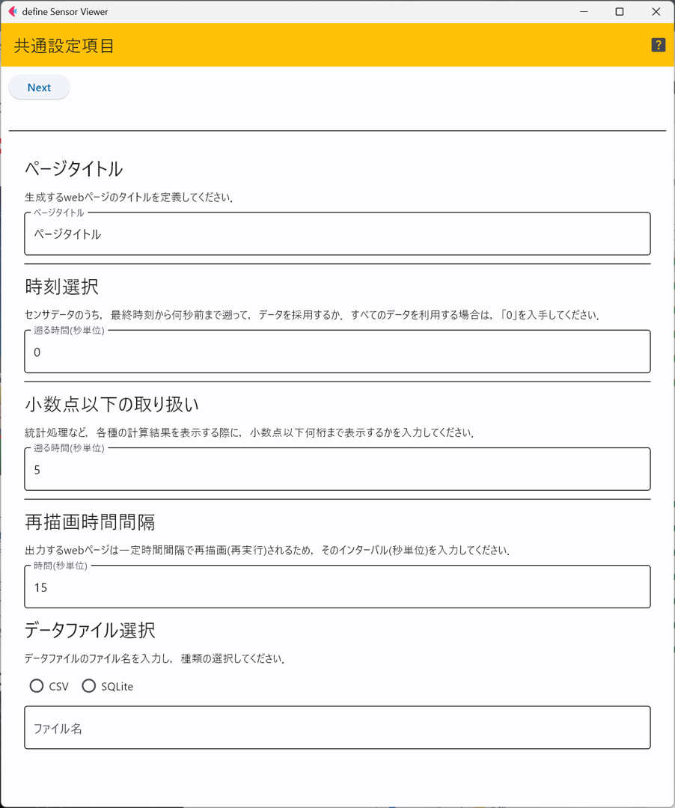
</div>

### 1.1. ページタイトル
最終的に生成されるデータ可視化のWebページにつけるタイトル文字列を入力する．

### 1.2. 時刻選択
データファイルに含まれるデータが非常に長時間の観測結果のものである場合がある．
このような場合に，古いデータを除外する．この欄では，採用するデータとして最新(最終)のデータからどこまで
遡るかを指定する．入力欄の注意書きにもあるように，遡る時間は秒単位で指定する．

### 1.3. 小数点以下の取り扱い
統計処理結果などの数字を表示する場合に，小数点以下何桁まで表示するかをこの欄で指定する．
そのため，多くの表示項目毎に異なる桁数を用いることはできない．

### 1.4. 再描画時間間隔
最終的に出力されるWebページは，一定周期でデータを読み直し，データ解析と描画をやり直す仕組みとなる．
この際の，処理や描画を繰り返す周期を秒単位で指定する．

### 1.5. データファイル選択
この欄では，生成されたWebページが読み取るデータファイルのファイル名を入力する．
生成されたWebページがどこで実行されるかわからない(ローカルのPCとは限らない)ため，
ダイアログボックスではなく，文字列で入力する必要がある．

サーバで実行する場合，ファイルパス名で利用可能な文字がWindowsとは異なる可能性も
あるため，どこで実行するかを想定した上で入力する．

## 2. センサ選択
可視化するデータを含むファイルは目的とするセンサ以外の観測データを含んでいる可能性がある．
そのため，データファイルの中で，どのセンサの観測データを可視化するかを選択する．

この画面では，可視化対象のMQTTトピック，センサの種類，センサIDを指定する．

なお，「監視対象追加」ボタンを押すことで，監視対象を増やすことができる．

<div style="text-align: center;">
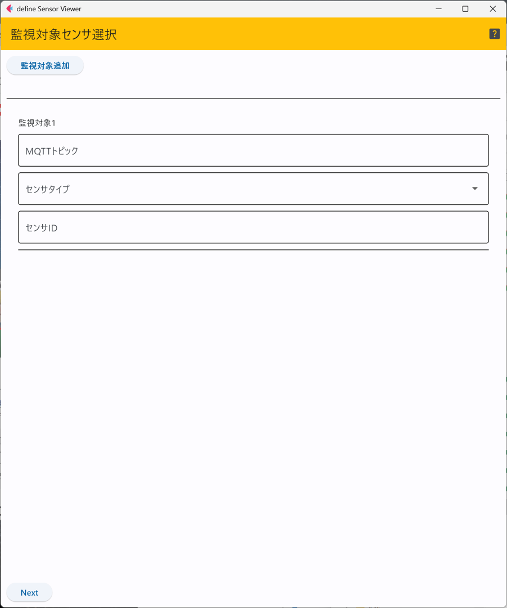
</div>

### 2.1. MQTTトピック
各データには，MQTTプロトコルでの通信で用いられたトピック文字列が付与されている．データファイルの中から，
特定のトピックを持つものだけを選択するため，この欄に表示対象となるデータが持つトピックの文字列を指定する．

データに付与されているトピック文字列が不明な場合，データファイルがCSVの場合は，Excel等で確認する．


### 2.2. センサタイプ
統計処理と可視化の対象とするデータの元となるセンサの種別をメニューから選択する．

現在サポートしているセンサの種類は下図に表示されている

<div style="text-align: center;">
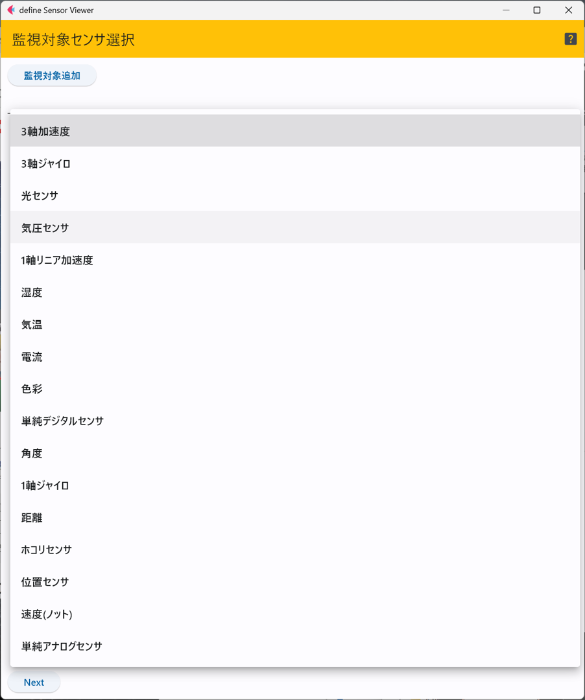
</div>

データファイルをExcel等で覗いた場合，3列目に``type``という値が整数で入っており，名称はデータファイルには
書かれていない．この整数値とセンサ種別の対応関係は以下の表の通り．

|番号|名称|
|---|---|
|1|3軸加速度|
|4|3軸ジャイロ|
|5|光センサ|
|6|気圧センサ|
|9|1軸リニア加速度|
|11|湿度|
|12|気温|
|14|電流|
|15|色彩|
|16|単純デジタルセンサ|
|17|角度|
|18|1軸ジャイロ|
|19|距離|
|21|ホコリセンサ|
|23|位置センサ|
|25|速度(ノット)|
|16|単純アナログセンサ|

### 2.3. センサID
センサ端末には，同じ種類のセンサが複数取り付けられる可能性があるため，センサには整数のID番号が付与されている．
処理対象とするセンサを指定する場合，ここにセンサのIDの整数値を入力する．

下図は入力例であるが，この例では，センサIDを-1にしている．センサIDが-1の場合，
MQTTトピックとセンサの種類さえ一致すれば，センサIDの値に関係なく，
全てのデータを抽出する．

<div style="text-align: center;">
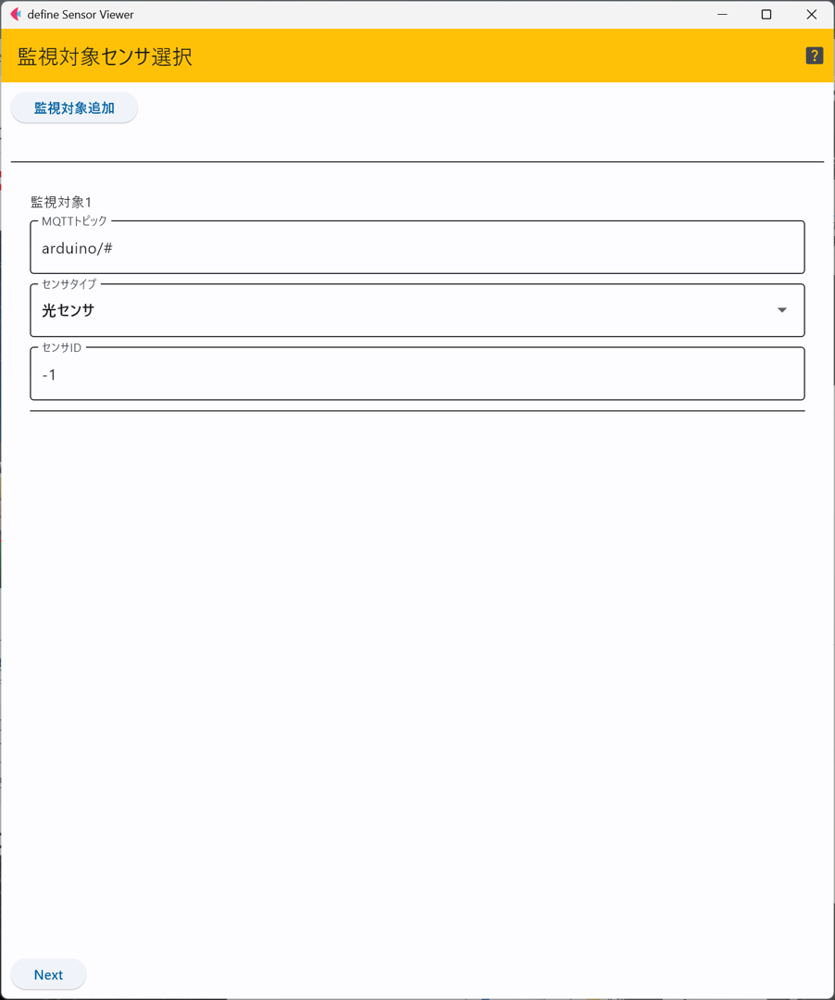
</div>

センサIDが不明な場合，データファイルをExcel等で確認すると，2列目の``id``がセンサIDが書き込まれているため，それを用いる．
この``id``が``-1``の場合，データを出力したセンサ端末にセンサが1つしかつながっていないなど，
IDで区別する必要がない場合を意味している．

### 2.5. 複数のデータ(系列)を1つのWebページで処理/表示したい場合
1つのWebページで複数のデータを分析，可視化することは珍しくない．
このような場合は，データファイルに含まれる複数のデータ系列を指定する必要があるため，1つの
データに関するトピックやセンサの種別，IDを指定した後，「``監視対象追加``」ボタンを押す．

### 2.4. 指定したデータの系列の呼び名
後ほど，選択したデータ(の系列)に対する統計処理内容や可視化の手法を指定する．
統計処理や可視化の対象のデータを指定する必要があるが，これは，トピックやセンサの種別を指定するメニューのところに
表示されていた「``監視対象1``」とか「``監視対象2``」といった名称で指定する．


## 3. データに対する前処理
統計処理や可視化を行う対象が，センサの出力データそのままであるとは限らず，
直前の値との変化量(差分)や，過去何個分かの平均値を用いることは珍しくない．
このようなデータに対する前処理を指定する．

### 3.1. 選択可能なデータ系列
先のメニューでトピックやセンサ種別等を用いて指定したデータの系列が画面のサブタイトル「監視対象センサから出力されるデータの系列」の
下に一覧で表示されているはずである．下図の例では，光センサの系列が1つだけ指定されていることを表している．

この中からどのデータ系列にどのような前処理を施すかを先に決めておく．

<div style="text-align: center;">
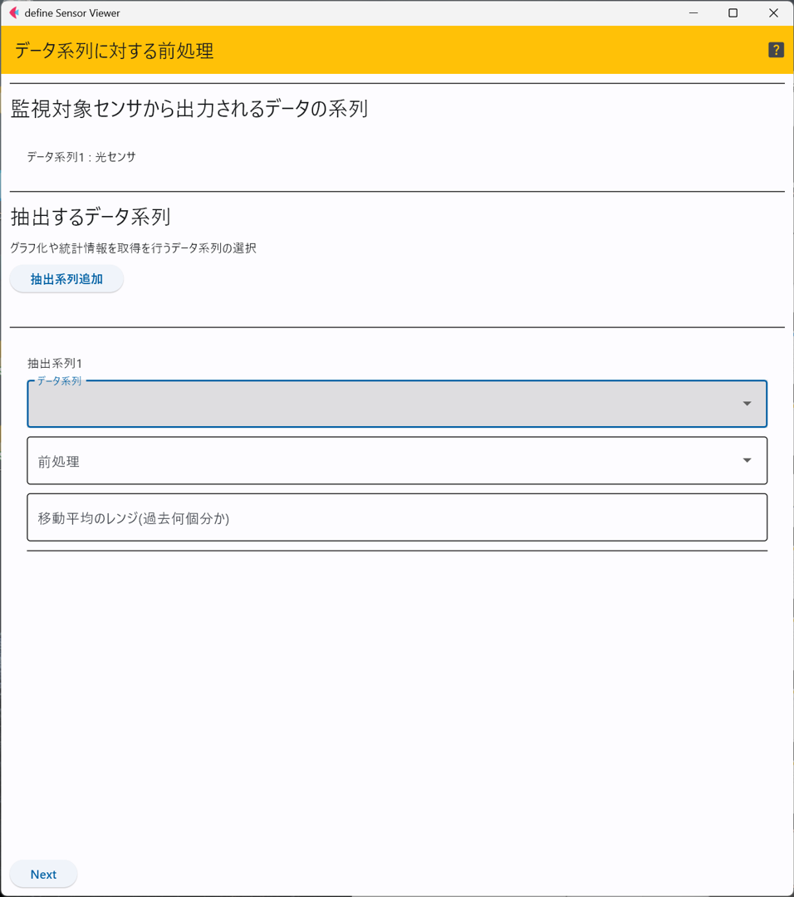
</div>

### 3.2. データ系列の選択
上の図のフォーカスされている入力欄(抽出系列1の「データ系列」欄)はプルダウンメニューとなっており，
トピック等で指定したデータ系列の中から，実際に処理，可視化するデータ系列を選択する．

<div style="text-align: center;">
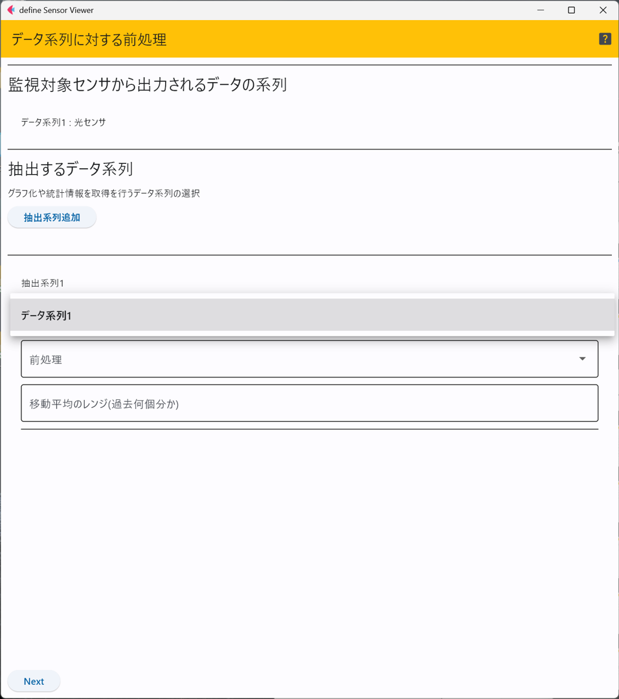
</div>

### 3.3. 前処理の種別の選択
2番目の前処理も同じくメニューで選択する．
特に，前処理をする必要がない場合は「そのまま」を選択する．

<div style="text-align: center;">
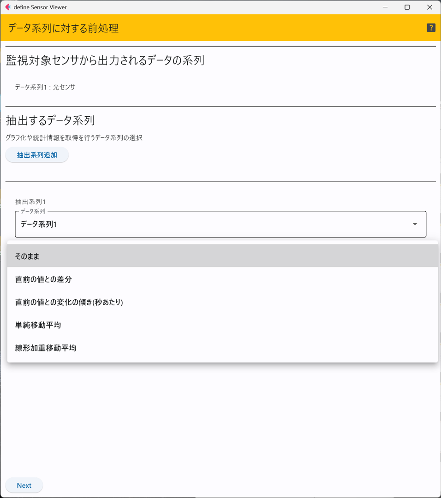
</div>

### 3.4. 前処理にパラメータが必要な場合のパラメータ入力
先ほど指定した前処理の種類のうち，「単純移動平均」と「線形加重移動平均」では，過去何個分のデータを
平均を計算する際の対象にするかを選択する必要がある．この何個分にするかの整数値を入力する．

下図の例では，前処理として「単純移動平均」を選択しているため，
過去何個分を単純移動平均の対象とするかの数字を3つめの欄に入力している．

<div style="text-align: center;">
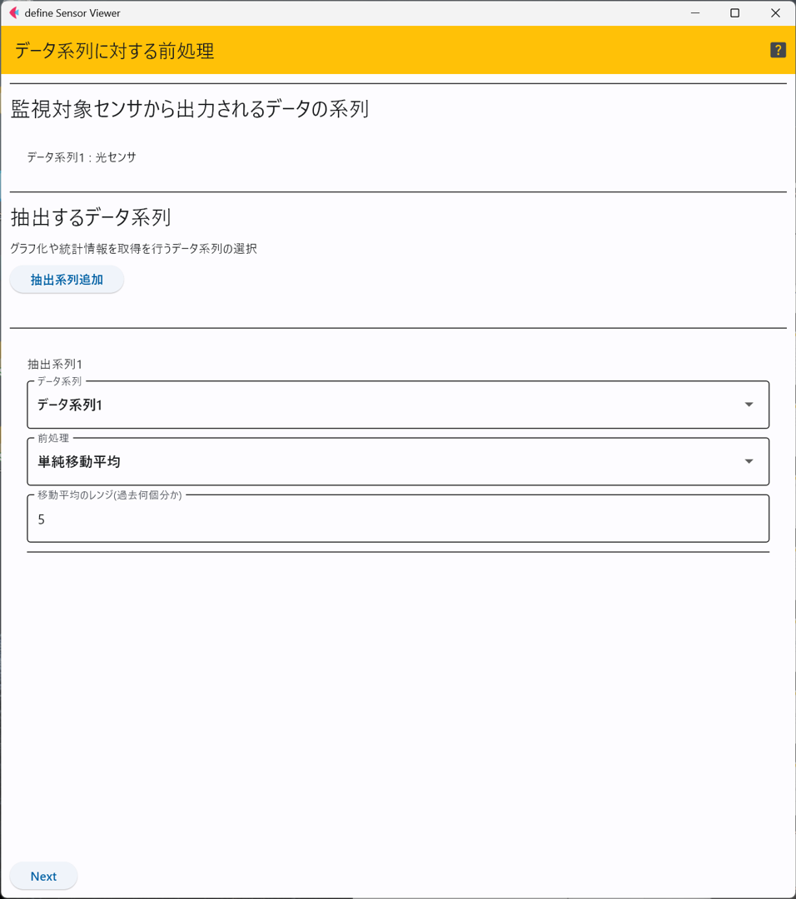
</div>

## 4. 統計処理


### 4.1. 統計処理実施の選択
ここでは，先ほど指定したデータ系列に対して，統計処理結果やデータの度数分布グラフの表示を
行うか否かを選択する．

<div style="text-align: center;">
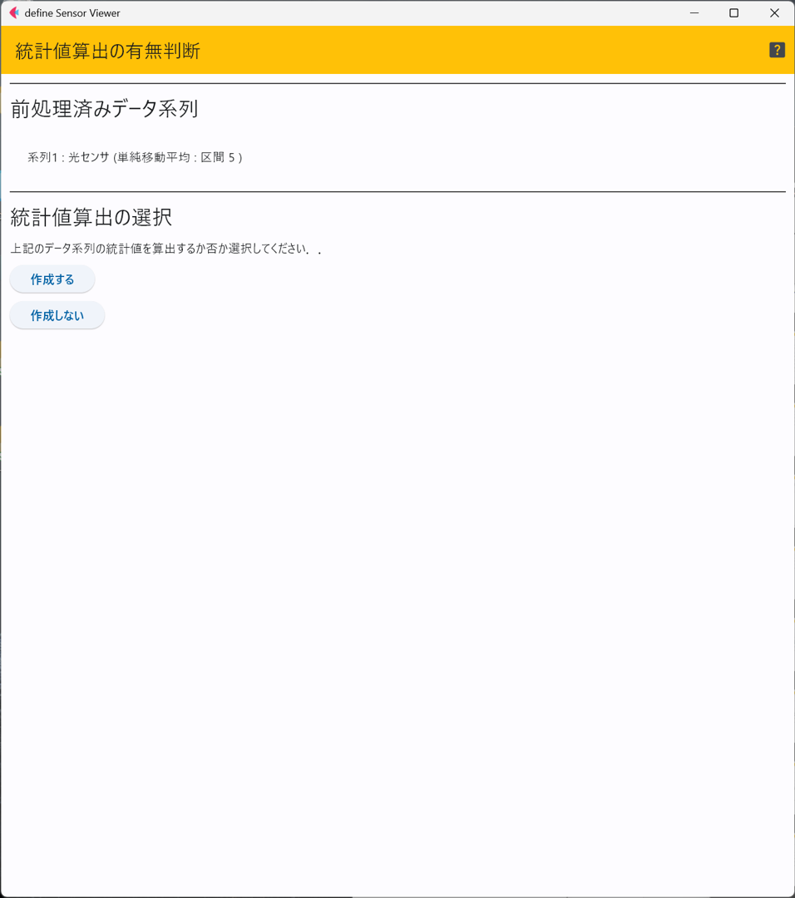
</div>

### 4.2. 統計処理/グラフ化のパラメータ入力
統計処理を実施する(作成する)を選択した場合，どのデータ系列に対して統計処理や度数分布グラフを作成するかを指定する．
特に，グラフについてはタイトルや軸の表記等を指定する必要があるため，各種のパラメータをこの画面で入力する．

対象のデータ系列は，ドロップダウンメニューから選択できるが，
ウィンドウ一番上の「前処理済みデータ系列」に選択可能なデータ系列がリストで表示されるので，
どのデータ系列にどのような統計処理を施すかを考えておく．

<div style="text-align: center;">
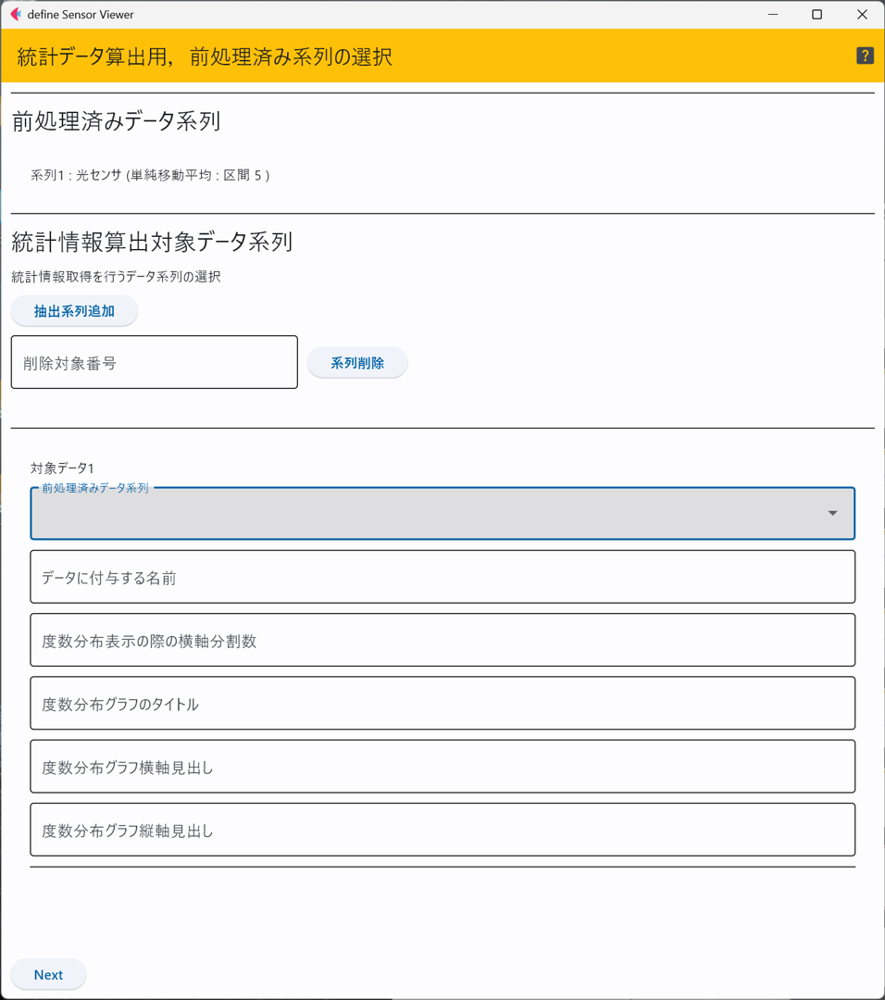
</div>

下図はその入力事例である．この例ではデータ系列は1つしかないため，ドロップダウンメニューで選択できる系列は
1つに限定される．次に，グラフ化するような場合にデータに名前をつける必要があるため，その名称を文字列で入力する．

3番目の項目は，度数分布を作る際に，最小値と最大値の間を何個に分けて数えるかの分割数を入力する．
4番目の項目は，度数分布グラフのタイトルを文字列で入力し，5番目と6番目の項目で，度数分布グラフの縦軸，横軸の
見出しを文字列で入力する．


<div style="text-align: center;">
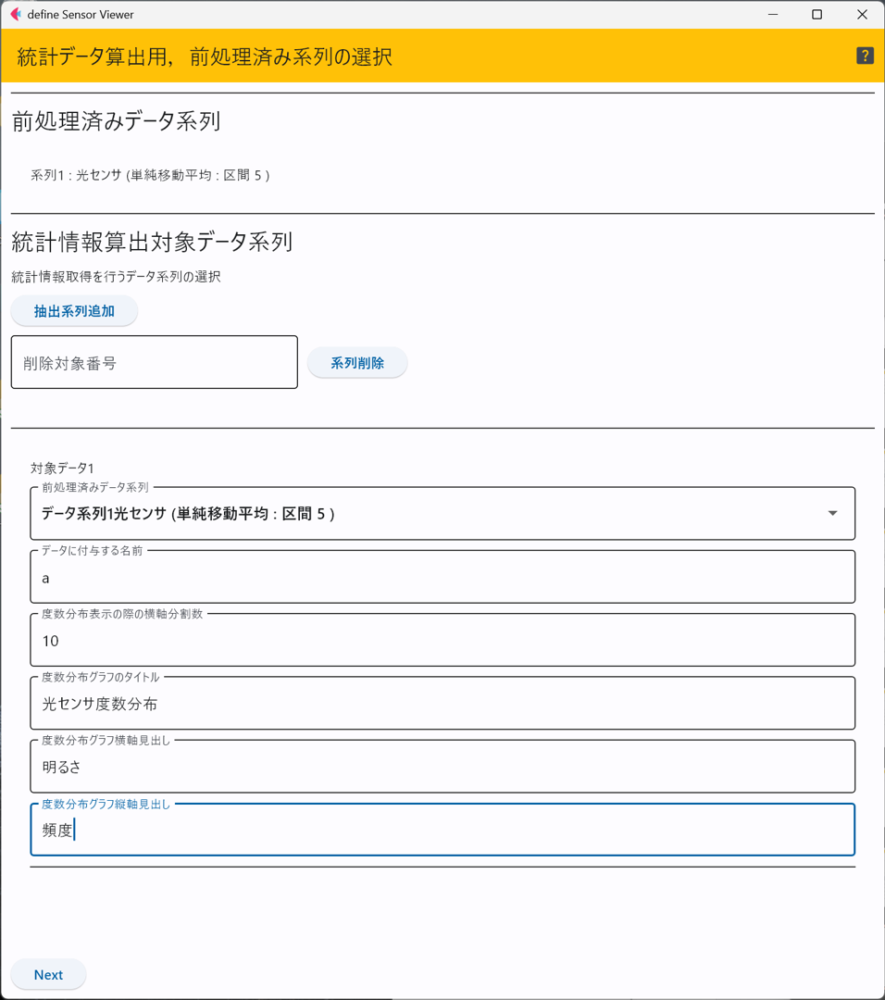
</div>

### 4.3. 統計処理対象選択の解除/追加
「統計処理/可視化を行う」を選択したものの，統計処理と可視化を取りやめる場合は，「削除対象番号」と書かれた欄に
統計処理/可視化の系列の番号を入れて，処理対象から外す．また，複数の前処理済みのデータ系列がある場合に，
2番目，3番目のデータ系列を処理対象に追加する場合は「抽出系列追加」ボタンを押して，2番目,3番目の
データに対する統計処理，可視化のパラメータを入力する．


## 5. 時系列グラフ
ここでは，時系列のデータから成り立っている各センサデータの時系列グラフを作るか否か，作るとした場合に
どのようなパラメータで作成するかを指定する．

### 5.1. グラフ数の定義
まず最初に何個のグラフを作成するかを定義する．もし，時系列グラフを作らない場合は入力欄に0を入力する．
<div style="text-align: center;">
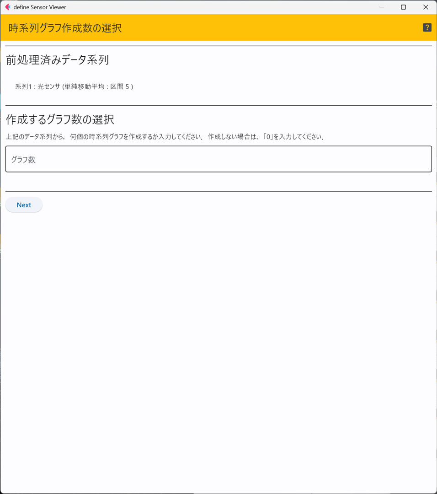
</div>

### 5.2. グラフのパラメータ入力
次に，グラフのタイトルや描画するデータ系列を宣言する．

最初に，グラフのタイトル，2,3番目の入力欄に横軸と縦軸のラベルやデータの単位系のような表示すべき内容を文字列で入力する．

一番下の「前処理済みデータ系列の選択」のメニューで，どのデータ系列をグラフに描画するかを選択する．
また，グラフの凡例表示のためのデータの名称も文字列で入力する．

<div style="text-align: center;">
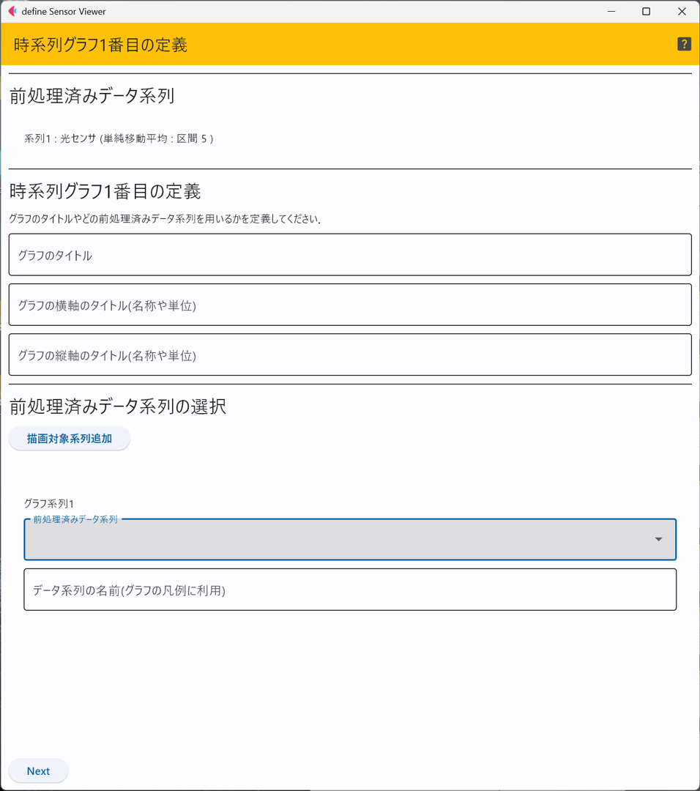
</div>


下図は入力した事例であるが，1つの時系列グラフに複数のデータ系列を描画
することも可能であり，その場合は，「描画対象系列追加」をクリックする．

ただし，縦軸は1つに限定されるため，単位系が同じデータ系列でなければならない．

<div style="text-align: center;">
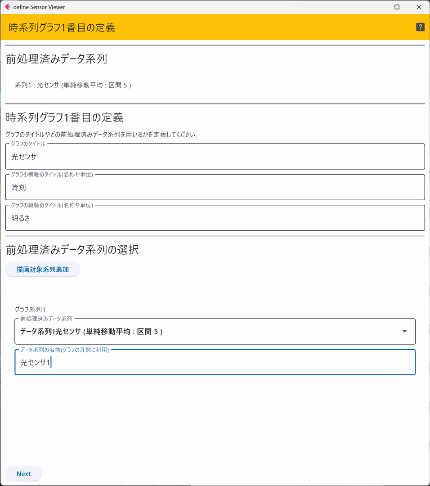
</div>

## 6. 相関分析
そのアプリケーションで定義するWebページでは，2つのデータ系列の相関分析も
可能である．

相関分析を行う組み合わせの数の指定やデータ系列の定義を行う．

相関分析を行う場合は，組み合わせ数を入力し，「Next」をクリックした後，
データ系列を選択する画面に遷移するため，そちらで系列を選択する．

もし，相関分析を行わない場合は，ここで，0を入力する．

<div style="text-align: center;">
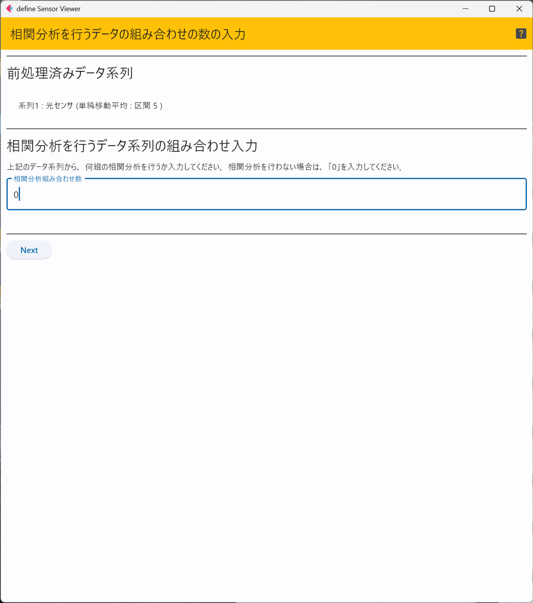
</div>

上の図では，データ系列が1つしかないため，0を入力して相関分析を行わない指定をしている．相関分析が
可能なデータ系列の組み合わせは，同じ時刻，同じ周期で取得されたデータであるため，
3次元加速度センサの出力等は3個のデータの組み合わせであるため，(x,y),(x,z),(y,z)の3組のデータの
組み合わせに対する相関分析が可能となる．

相関分析を行うデータ系列のデータの測定頻度や測定時刻に違いがあると，相関分析ができない．
これに対応するためには，
本アプリケーション集に含まれる別のアプリケーション(dataFilter)を
利用する．

dataFilterは，複数のセンサが，異なるタイミング，周期で測定したデータから決められた周期のデータをピックアップして，
同じ時刻のデータとして出力する機能を持つ．これにより，相関分析が可能なデータとなるため，データファイルの
中身を事前に確認しておき，dataFilterで加工しておく必要がある．

## 7. エラーチェック
あるデータ系列に着目した場合に，異常値を検出するような目的で利用する機能となる．

この異常値チェックを行うルールはjavascriptのプログラムを入力する必要があり，入力された
プログラムの返り値が偽(``false``)の場合に異常値として取り扱われ，Webの画面上にメッセージが
出力される．

一番単純なのは，データの値が定数と比較した場合の大小で判定する例であるが，複雑な
処理を行うこともできる．例えば，外部のjavascriptライブラリを利用して
統計処理等の結果を定数と比較するような使い方も考えられる．

### 7.1. 数の定義

最初の画面では，このような異常値判定ルールの数と，判定ルールで外部ライブラリを
用いる場合に，何個のライブラリを利用するかを入力する．

異常値の検出を行わない場合，異常値の検出で外部ライブラリを用いない場合は，
それぞれの個数入力欄に0を入力する．


<div style="text-align: center;">
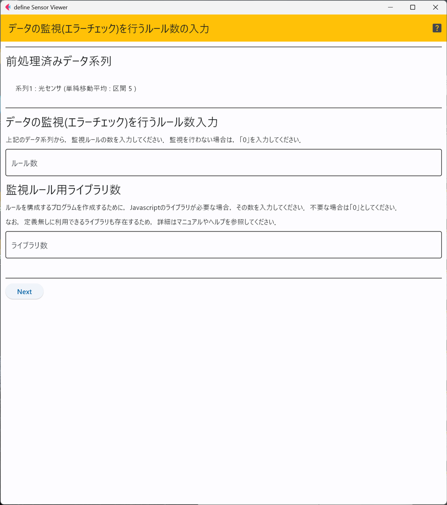
</div>

### 7.2. エラーチェックルール
この画面では，ルールとルールにヒットした場合に画面に出力するメッセージを入力する．
<div style="text-align: center;">
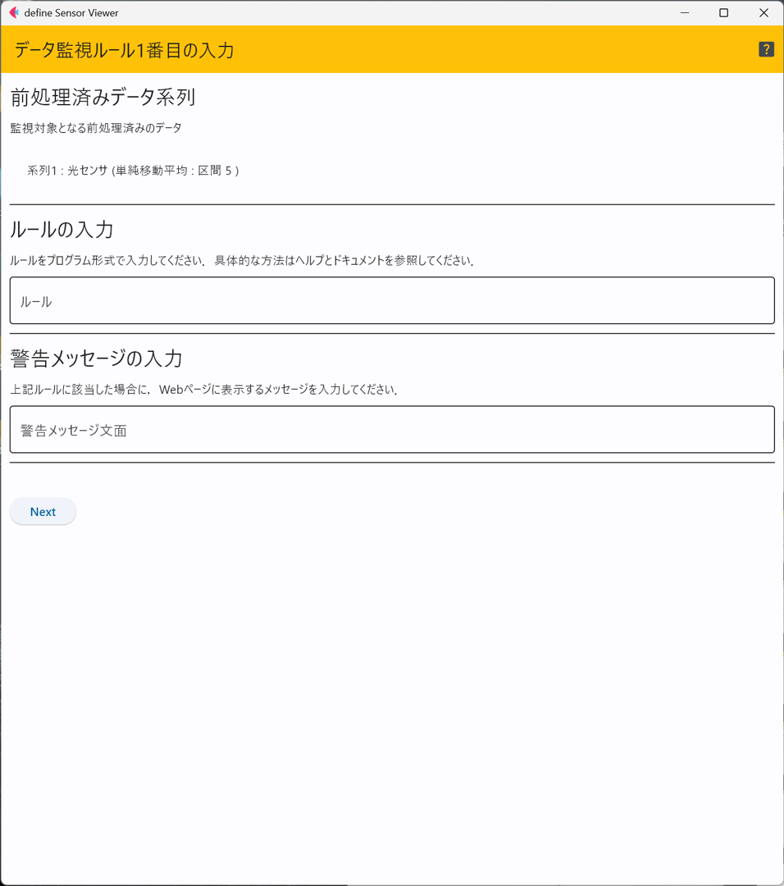
</div>


下の図は定義した事例であり，明るさの値が一定値を超えた場合にメッセージを表示するようになっている．

<div style="text-align: center;">
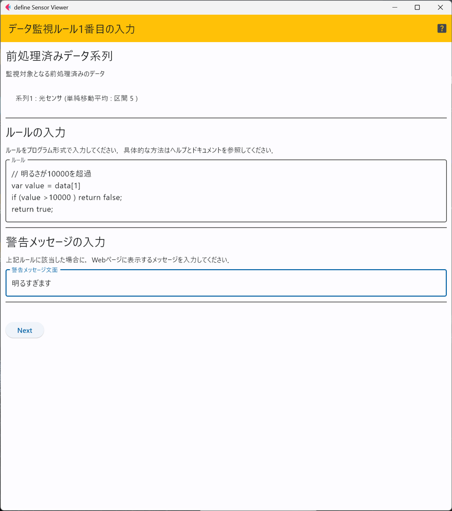
</div>


### 7.3. プログラムの作り方
ルールは検査する関数の中身だけを埋める形であり，1回の検査でアクセスできる値は1つの測定値に限定される．
そのため，測定値を配列や行列としてアクセスすることはできない．

また，上の図の例のように，配列``data``がデータが収められている配列で``data[0]``が測定データの時刻情報``data[1]``が値である．
返り値として``false``を返せばメッセージが出力される．

### 7.4. 外部ライブラリの定義
javascriptのライブラリをエラーチェックルールから使うには，出力のWebページに外部ライブラリを使う宣言を
埋め込む必要がある．本プログラムでは，インターネットからhttpsで取得可能なライブラリのみを想定している．

以下の2行は最終的に出力されるWebページに必ず含まれるライブラリ定義の内容である．
この2種類のライブラリ(googleチャートとsql-wasm)は何もしなくても，必ずロードされるため，
外部ライブラリとして定義する必要はない．

ここからの説明では，もし，デフォルトでロードされるライブラリの定義を自分で行うとしたら，
どのように入力すれば良いかを示す．

```
<script type="text/javascript" src="https://www.gstatic.com/charts/loader.js"></script>
<script src="https://cdnjs.cloudflare.com/ajax/libs/sql.js/1.8.0/sql-wasm.min.js" integrity="sha512-VYs2RuvWreNg7oouVhZ/9bEvdPgyd5L2iCPCB8+8Qks/PHbmnc82TQOEctYoEKPveJGML8s+3NGcUEZYJrFIqg==" crossorigin="anonymous" referrerpolicy="no-referrer" ></script>
```

最初は，sql-wasm(cloudflareからロードしているライブラリ)の事例である．上のsql-wasmの定義を見ると，```<script>```の中に``type``の定義はないため，
1行目の「タイプ」欄は空行としている．

2つ目の入力欄はライブラリのURLをそのまま入力する．3つ目以降の入力欄は，セキュリティ用の``integrity``値等を入力する．

<div style="text-align: center;">
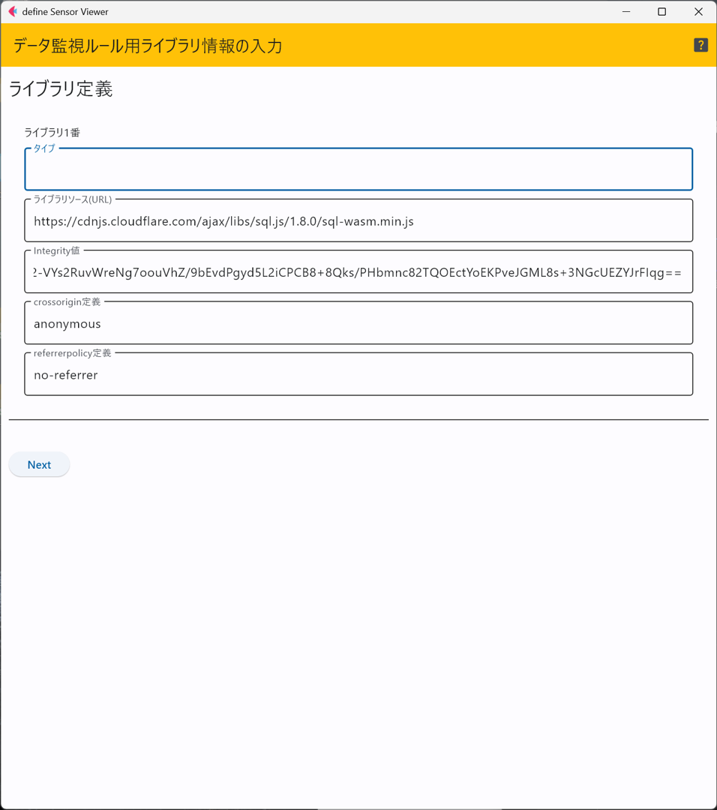
</div>


```
<script type="text/javascript" src="https://www.gstatic.com/charts/loader.js"></script>
```

下の図は，Googleチャートをロードする定義(上に抜き出したものを記載)を画面で行う場合の事例となっている．
Googleチャートでは，``script``に``type``定義があるため，1つ目の入力欄に``type``の値を入れる．
URLはそのまま転記し，セキュリティ関係の定義は不要であるため，3つ目以降の入力欄は空欄のままとする．

<div style="text-align: center;">
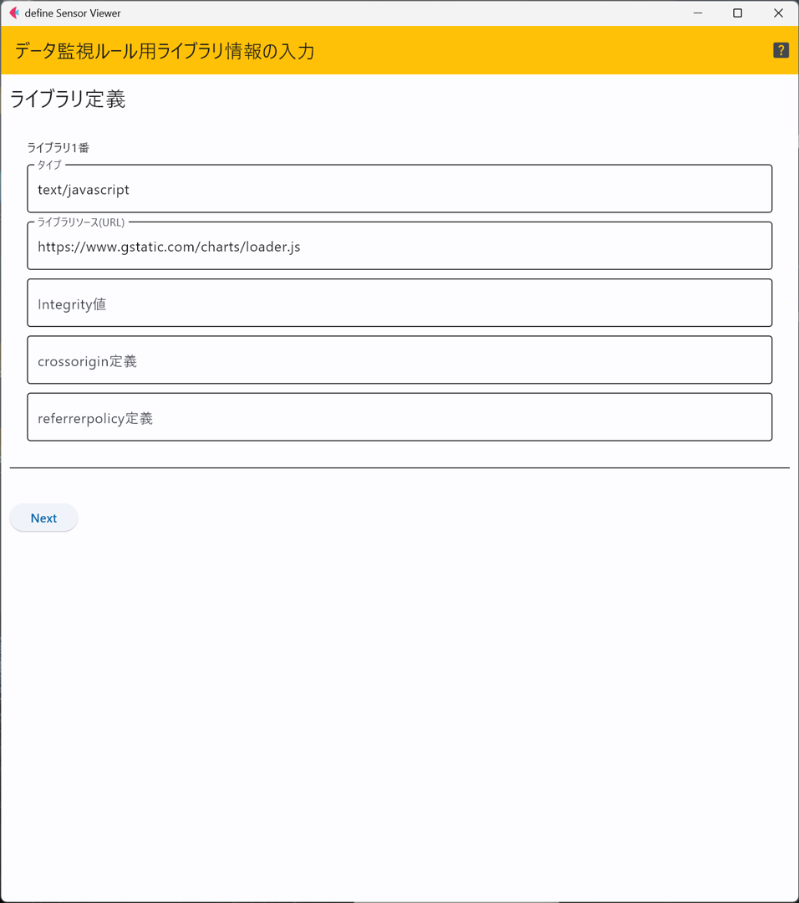
</div>

以上のように，最終的なWebページに埋め込まれる出力を想定して，メニューに入力していく必要がある．


## 8. 出力ファイル指定

この画面では，最終出力となるWebページ(HTML+javascript)のファイル名を指定し，
出力ボタンを押すことで，ファイルを生成させる．
<div style="text-align: center;">

</div>

***
- [READMEに戻る](README.md)
