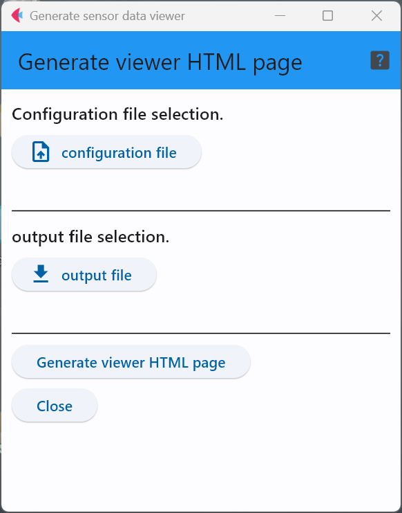

# genSensorViewer

genSensorViewerは，defineSensorViewerの出力であるyamlファイルを入力することで，
センサデータを可視化するWebページ(HTML+Javascript)を生成する．

下図の画面で入力と出力のファイルを指定した上で「Generate...」ボタンをクリックすることで，
Webページが出力される．

***
- [READMEに戻る](README.md)

