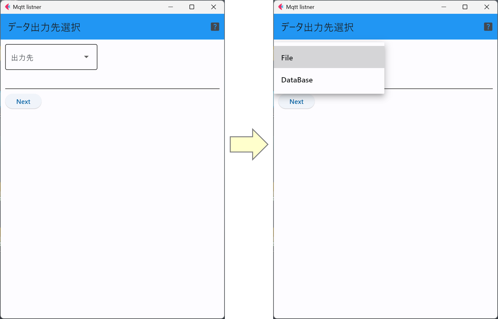

# mqttListner : センサデータ受信プログラム

mqttListnerは，MQTTブローカから特定の性質(トピックやセンサの種類など)を持つ
センサデータを受信し，ファイルに蓄積する．

ユーザは取得すべきセンサデータの性質(以下のリスト)を指定する．
- トピック
- センサの種類(光量，温度，湿度など)
- センサID(整数値)

また，受信したセンサデータを書き込むファイルの種類はSQLiteデータベースとCSVファイルから
選択することができる．

## 1. ネットワーク関連設定
起動直後の画面では，MQTTブローカについての情報を入力する．入力すべき項目は以下の4種類．
- MQTTブローカが動作するIoT GWのIPアドレス
- MQTTブローカが待ち受けるポート番号
- MQTTのトピック
- MQTT接続に認証が必要かどうか

全て入力が済んだら「Next」ボタンをクリックする．

## 2. MQTT 認証
MQTTブローカ接続の認証で「Yes」を選択した場合のみ，この画面が表示される．ここでは，認証のユーザ名とパスワードを入力する．

## 3. 出力ファイル種別選択

ここでは，出力ファイルの形式がSQLiteデータベースかCSVファイルかを選択する．

## 4. 出力ファイル選択

この画面で出力ファイルをファイルダイアログで選択する．

## 5. 設定内容確認

設定内容を確認し，問題がなければ「Exec」ボタンを押し，問題があれば「Back」で設定を修正する．

## 6. MQTTデータ受信

先ほどの画面で，「Exec」を押すとMQTTブローカから転送されたセンサデータのうち，最新のものが
画面に表示され，新しいものが届くたびに更新される．

「Close」ボタンを押すと，受信が終了してしまうため，受信中はウィンドウを開き続けていなければならない．

***
- [READMEに戻る](README.md)

