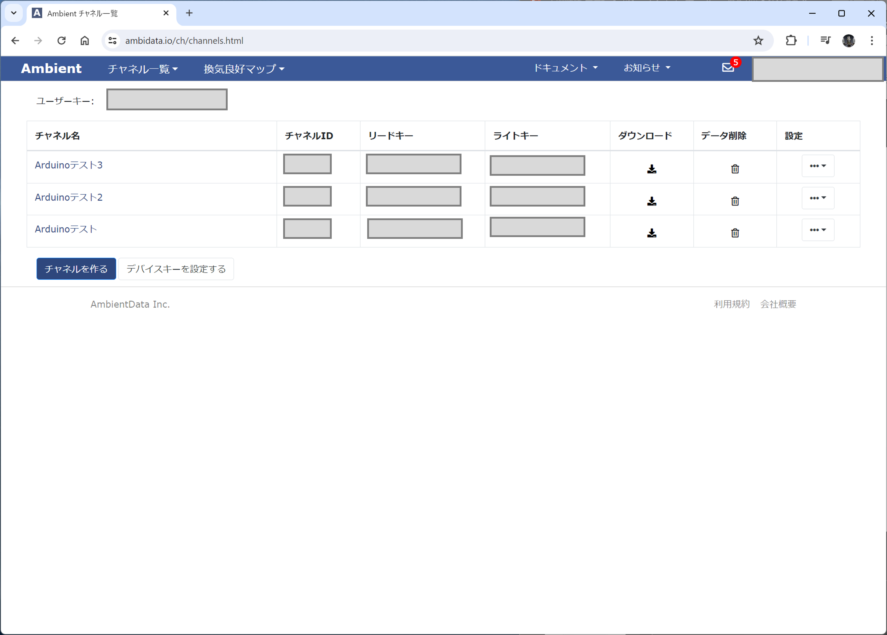
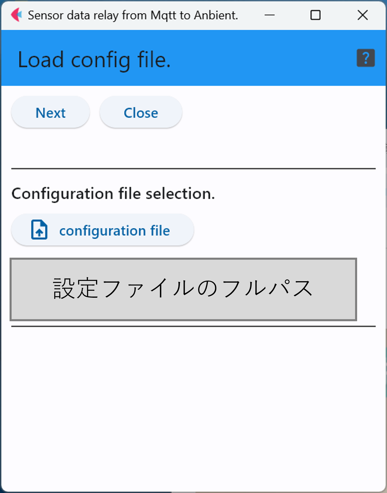
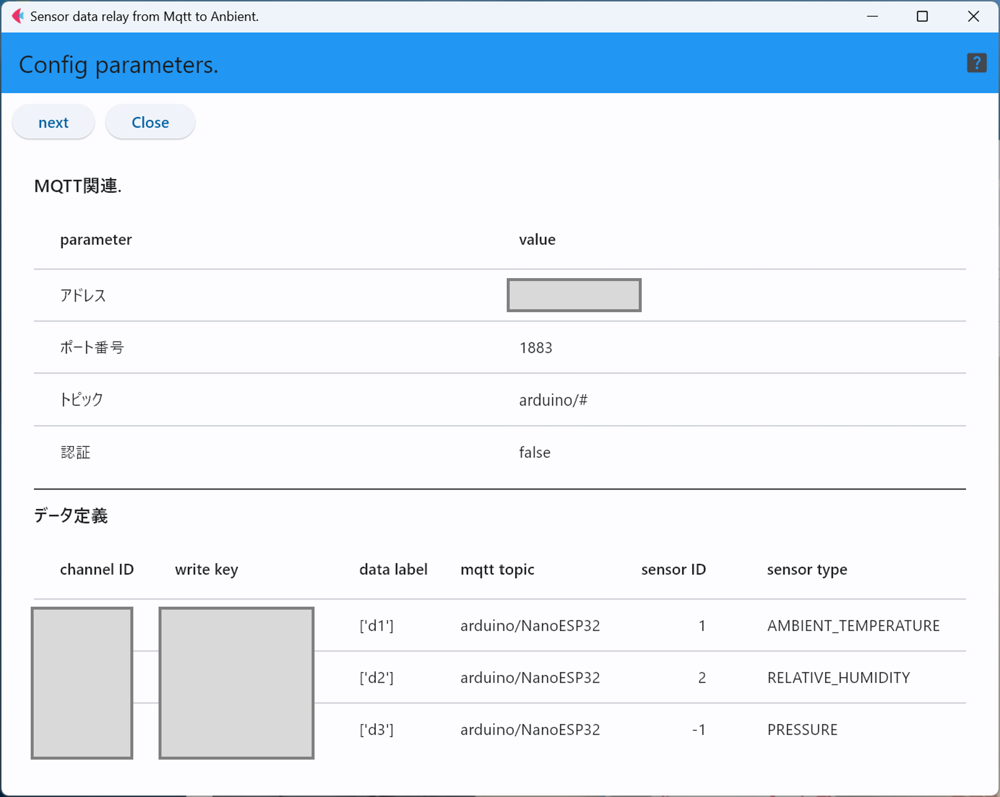
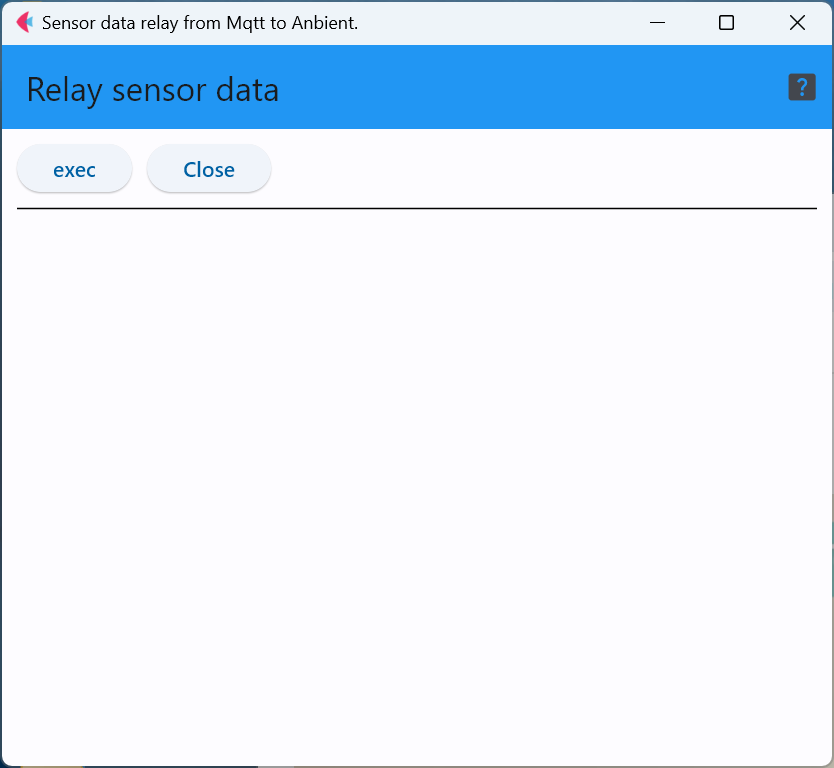

# mqttToAnbient


本ソフトウェアを利用する際には，事前に設定情報を書き込んだyamlファイルを用意するだけでなく，
[Anbient](https://ambidata.io/)サイト上での作業が必要な上，その作業はアップロードする
データの種類によって異なる．

そのため，以下の説明では，センサ端末として温度・湿度・気圧のデータを取得可能なBME280を
使ったセンサ端末のデータをアップロードすることを想定したシナリオで説明する．

## Anbientサイト上での作業

まず，最初に[Anbient](https://ambidata.io/)でアカウントを作成する．次に，チャネルを作成する必要があるが，
[Anbient](https://ambidata.io/)にログインすると，データを格納するチャネルの一覧が表示される．

1つのチャネルには8種類のデータ系列(d1からd8)を格納することができるため，下図のように3チャネル作成していれば
24種類のデータ(系列)を保存することができる．
ここでの例では，気温・湿度・気圧の3種類のデータを取り扱うため，1チャネルでも足りるが，
3チャネルに分けて保存する事例で説明する．

まず，3つのチャネルを作成し，作成した各チャンネルの「ID番号」と「ライトキー(書き込み用パスワード)」をメモしておく．

<div style="text-align: center;">

</div>


## 設定ファイルの作成

下は実際の設定ファイルの例である．

```
mqtt:
  address: 1.2.3.4 # MQTTブローカアドレス
  port: 1883 # MQTTブローカポート番号
  topic: arduino/# # MQTTトピック
  auth: False # True 認証する, False 認証しない
  user:  # MQTT認証ユーザ名
  pass:  # MQTT認証パスフレーズ
  timeout: 60
anbient:
  interval: 10
  time_stamp: 0 # 0 - クラウドMQTT転送時刻 , 1 - センサ端末観測時刻
mapping:
 - { channel: 12345, key: aaaaaaaaaaaaaaaa, label: [d1], topic: arduino/NanoESP32, sensorID: 1, sensorType: AMBIENT_TEMPERATURE }
 - { channel: 67890, key: bbbbbbbbbbbbbbbb, label: [d2], topic: arduino/NanoESP32, sensorID: 2, sensorType: RELATIVE_HUMIDITY }
 - { channel: 98765, key: cccccccccccccccc, label: [d3], topic: arduino/NanoESP32, sensorID: -1, sensorType: PRESSURE }
```

### ``mqtt``関連設定
この部分は，センサデータを保持しているはずのMQTTブローカが動作しているサーバやMQTTブローカソフトウェア関連の情報を入力する．
MQTTブローカを自分で運用していない場合は，管理者に問い合わせていただきたい．

なお，``timeout``はMQTTブローカが動作していない場合やネットワークが不通の場合にタイムアウトとみなす時間(秒)を指定する．


### ``anbient``サイト関連設定

- ``interval`` : このプログラムがMQTTブローカから取得したデータを[Anbient](https://ambidata.io/)に送信する間隔
- ``time_stamp`` : ``0``の場合は，送信時間がデータのタイムスタンプとして利用され，``0``以外の場合はセンサ端末が実際に測定した時刻が利用される．センサ端末の観測時間を利用する場合は，センサ端末のRTCの時刻を正しく保持する必要があるため，精度の高いRTCの利用や周期的な時刻合わせ，バッテリバックアップ等が必要になる．

### ``mapping`` (センサデータとチャネルの対応関係定義)

この例は，温度・湿度・気圧の3種類を別々のチャネルに保存する事例となっている．

まず，``channel``の番号と``key``の文字列は[Anbient](https://ambidata.io/)でチャネルを作成した際にメモしたものを書き込む．
下の例は，気温をチャンネルID「12345」のラベル「d1」に，湿度をチャンネル「67890」の「d2」，気圧をチャンネル「」の「d3」に書き込む設定になっている．
```
 - { channel: 12345, key: aaaaaaaaaaaaaaaa, label: [d1], topic: arduino/NanoESP32, sensorID: 1, sensorType: AMBIENT_TEMPERATURE }
 - { channel: 67890, key: bbbbbbbbbbbbbbbb, label: [d2], topic: arduino/NanoESP32, sensorID: 2, sensorType: RELATIVE_HUMIDITY }
 - { channel: 98765, key: cccccccccccccccc, label: [d3], topic: arduino/NanoESP32, sensorID: -1, sensorType: PRESSURE }
```

``topic``，``sensorID``と``sensorType``は必要なセンサデータに対応するMQTTトピックと
センサデータ内に格納されているセンサのIDおよび，センサの種類の情報を指定する．
この際，``topic``にパターンマッチ(``#``)は使えないため，完全に同一の文字列で指定する必要がある．

また，``sensorID``に``-1``を指定した場合は，MQTTでデータを取得した際に，``sensorID``を無視して
データのフィルタリングを行う．

最後に，``sensorType``は以下の表のいずれかの文字列を用いる．

|文字列|センサの種類|データ数|
|---|---|---|
| ACCELEROMETER | 3軸加速度 |3(x/y/z)|
| GYROSCOPE | 3軸ジャイロ |3(x/y/z)|
| LIGHT | 光センサ |1|
| PRESSURE | 気圧センサ |1|
| PROXIMITY | 近接センサ |1|
| LINEAR_ACCELERATION | 加速度センサ |(x/y/z)|
| ROTATION_VECTOR | 回転ベクトル センサー |1|
| RELATIVE_HUMIDITY | 湿度 |1|
| AMBIENT_TEMPERATURE | 気温 |1|
| CURRENT | 電流 |1|
| COLOR | 色彩センサ |4 (R/G/B/RGBA) |
| SIMPLE | 単純デジタルセンサ(0/1値) |1|
| ANGLE | 角度センサ |1|
| ONE_AXIS_GYRO | 1軸ジャイロ |1|
| DISTANCE | 距離 |1|
| DUST | ホコリセンサ |1|
| SPEED_KNOT | 速度(ノット) |1|
| POSITION | 位置 | 4(緯度/経度/高度/誤差)|
| SIMPLE_ANALOG | 単純アナログセンサ |1|

上の表でデータが複数存在するセンサについては，設定の``label``の項目に複数の値を指定すれば良い．
3軸加速度で下のように記述した場合は，d1がx軸，d2がy軸，d3がz軸となる．
```
 label: [d1, d2, d3]
```

## Anbient用Pythonライブラリのインストール
実際にアプリケーションを起動する前にPython用ライブラリをインストールしておく必要があるが，anbient用ライブラリは
特別なインストール手順が必要になる．

具体的には[https://ambidata.io/refs/python/](https://ambidata.io/refs/python/)を参考に，python用ライブラリをインストールする．


## アプリケーションの操作

### 設定ファイルのロード
まず最初に，作成した設定を記述したyamlファイルを読み込ませる．

「configuration file」ボタンでyamlファイルを指定し，「Next」ボタンで読み込ませる．
<div style="text-align: center;">

</div>

### 設定の確認
この画面では，読み込ませた設定ファイルの内容が表示されるため，
問題がなければ「Next」ボタンをクリック．もし，問題があれば「Close」ボタンで
アプリを終了し，yamlファイルを修正する．

<div style="text-align: center;">

</div>


### データ中継の実行とログの表示

この画面が表示された状態で「exec」ボタンをクリックすることで，データの中継が開始される．中継対象となったデータは1データ1行の形で画面に表示される．

<div style="text-align: center;">

</div>


***
- [READMEに戻る](README.md)

