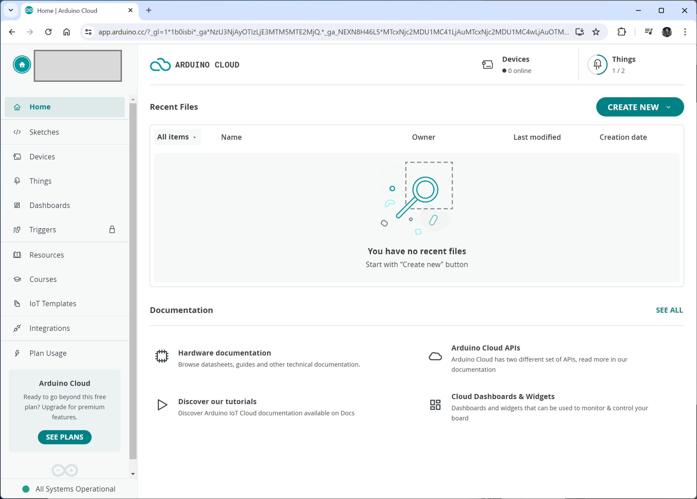
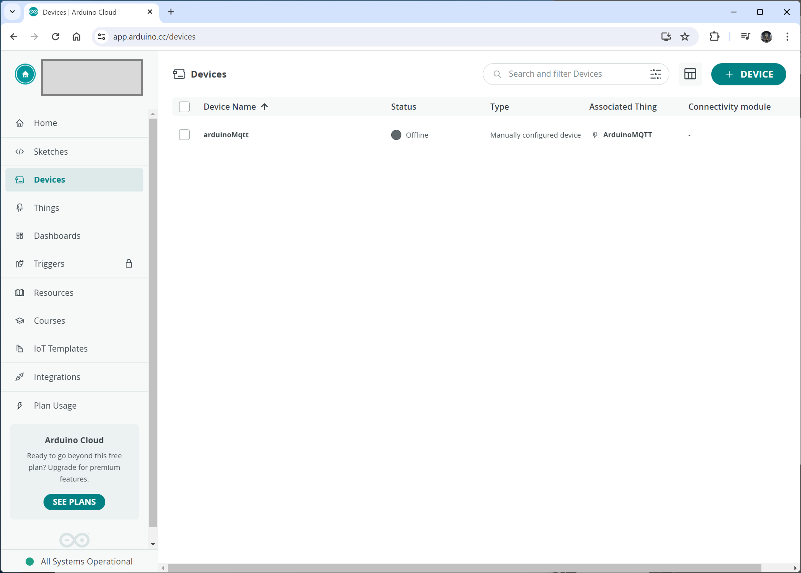
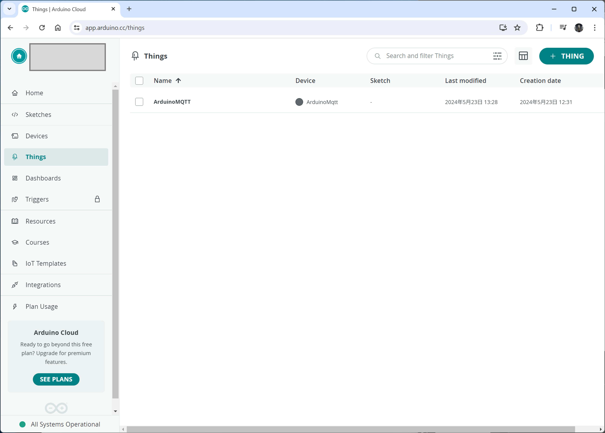
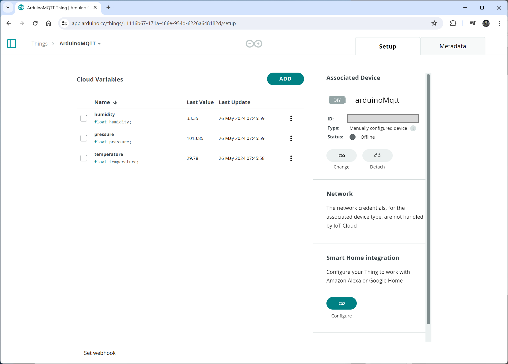
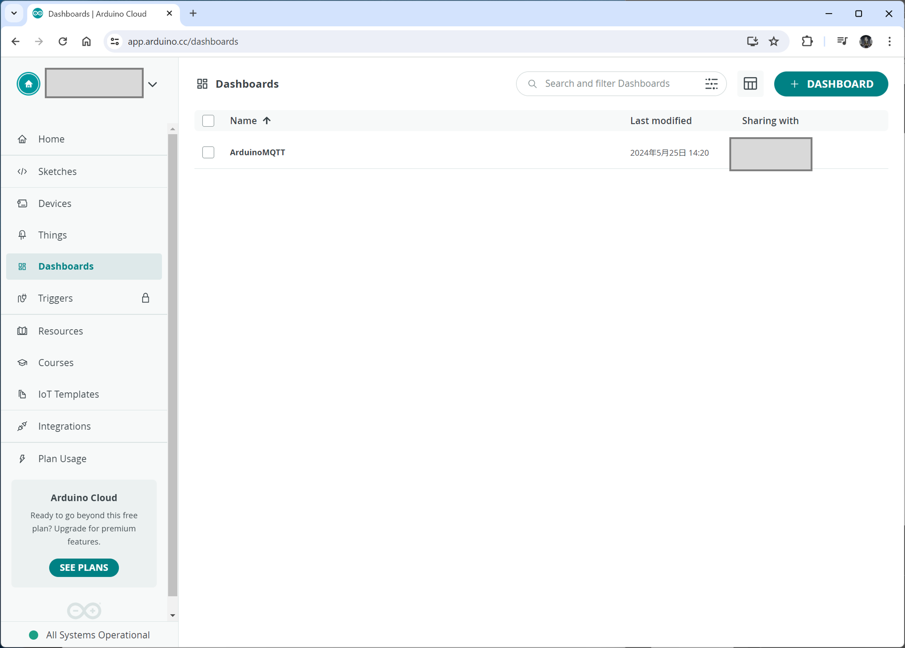
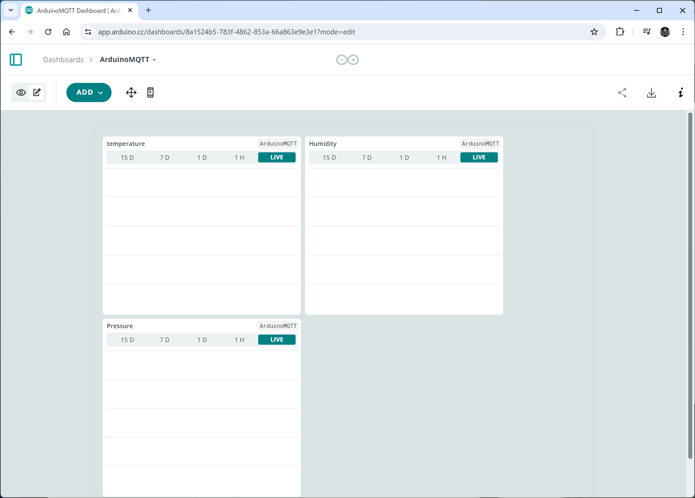
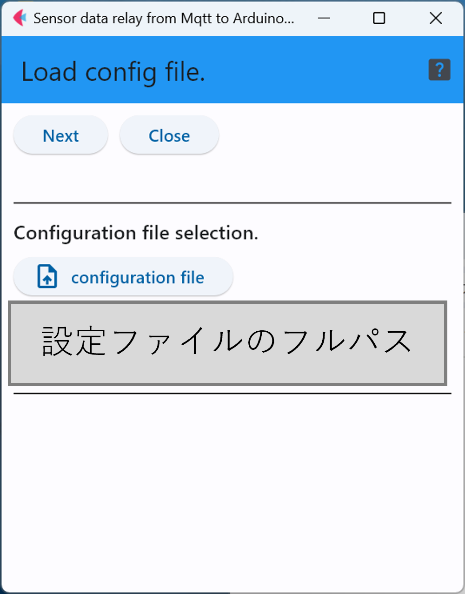
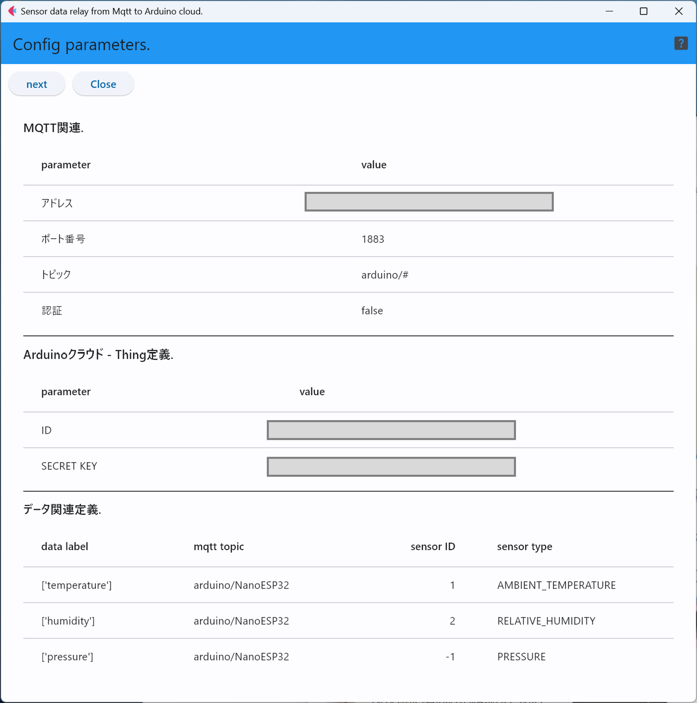
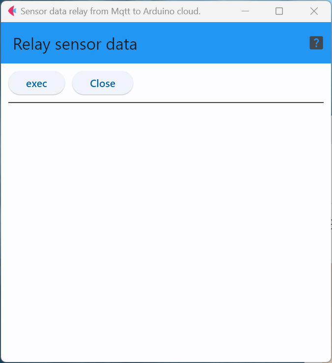

# mqttToArduino

このソフトウェアは，MQTTブローカからセンサデータを取得し，そのデータをArduino Cloudに転送するプログラムである．


## Arduino Cloudの準備
まず，はじめにArduino Cloudにアカウントを作成してログインする．

<div style="text-align: center;">

</div>


### デバイス定義の作成
次に，クラウドに接続するデバイスを定義するが，本プログラムでのデータ転送を利用するためには，「マニュアル」デバイスを作成する必要がある．

<div style="text-align: center;">

</div>

なお，この時に，Device IDとkey(パスフレーズ)が生成され，そのPDFがダウンロード可能になるはずなので，
PDFをダウンロードして別途保存しておく．

### 「Things」の定義
このプログラムでのデータを送信するために，先ほど作成した「Device」に対応する1つの「Thing」を定義する．
<div style="text-align: center;">

</div>

次に，作成したThingのページを開き，その中にセンサデータと結びつけるクラウド変数を定義する．
今回は，温度・湿度・気圧の3種類のデータを転送するため，3つの変数を定義する．
<div style="text-align: center;">

</div>

### ダッシュボード
今回は1つのThingを監視するためのダッシュボードであるため，1つ定義する．
<div style="text-align: center;">

</div>

定義したダッシュボードを開き，内部に温度・湿度・気圧を表示するグラフを貼り付ける．
<div style="text-align: center;">

</div>


## 本ソフトウェアの定義ファイル作成

下は温度・湿度・気圧センサ(BME280)を使う場合の実例になっている．

```
mqtt:
  address: 1.2.3.4 # MQTTブローカアドレス
  port: 1883 # MQTTブローカポート番号
  topic: arduino/# # MQTTトピック
  auth: False # True 認証する, False 認証しない
  user:  # MQTT認証ユーザ名
  pass:  # MQTT認証パスフレーズ
  timeout: 60
arduino:
  id: aaaa-bbb-ccc-ddd-eee
  key: abcdefg
mapping:
 - { label: [temperature], topic: arduino/NanoESP32, sensorID: 1, sensorType: AMBIENT_TEMPERATURE }
 - { label: [humidity], topic: arduino/NanoESP32, sensorID: 2, sensorType: RELATIVE_HUMIDITY }
 - { label: [pressure], topic: arduino/NanoESP32, sensorID: -1, sensorType: PRESSURE }
```


### ``mqtt``関連設定
この部分は，センサデータを保持しているはずのMQTTブローカが動作しているサーバやMQTTブローカソフトウェア関連の情報を入力する．
MQTTブローカを自分で運用していない場合は，管理者に問い合わせていただきたい．

なお，``timeout``はMQTTブローカが動作していない場合やネットワークが不通の場合にタイムアウトとみなす時間(秒)を指定する．


### ``arduino``サイト関連設定
``id``と``key``はデバイスを定義した際に，ダウンロードしたPDFに記載されているはずなので，その値をここに記入する．

### ``mapping`` (センサデータとチャネルの対応関係定義)

下の記述は，温度・湿度・気圧の3種類をThingsとセットで作成したクラウド変数に結びつける例になっている．

まず，``labe``の記述は，温度の値をクラウド変数``temperature``に保存することを表している．


```
 - { label: [temperature], topic: arduino/NanoESP32, sensorID: 1, sensorType: AMBIENT_TEMPERATURE }
 - { label: [humidity], topic: arduino/NanoESP32, sensorID: 2, sensorType: RELATIVE_HUMIDITY }
 - { label: [pressure], topic: arduino/NanoESP32, sensorID: -1, sensorType: PRESSURE }
```

``topic``，``sensorID``と``sensorType``は必要なセンサデータに対応するMQTTトピックと
センサデータ内に格納されているセンサのIDおよび，センサの種類の情報を指定する．
この際，``topic``にパターンマッチ(``#``)は使えないため，完全に同一の文字列で指定する必要がある．

また，``sensorID``に``-1``を指定した場合は，MQTTでデータを取得した際に，``sensorID``を無視して
データのフィルタリングを行う．

最後に，``sensorType``は以下の表のいずれかの文字列を用いる．

|文字列|センサの種類|データ数|
|---|---|---|
| ACCELEROMETER | 3軸加速度 |3(x/y/z)|
| GYROSCOPE | 3軸ジャイロ |3(x/y/z)|
| LIGHT | 光センサ |1|
| PRESSURE | 気圧センサ |1|
| PROXIMITY | 近接センサ |1|
| LINEAR_ACCELERATION | 加速度センサ |(x/y/z)|
| ROTATION_VECTOR | 回転ベクトル センサー |1|
| RELATIVE_HUMIDITY | 湿度 |1|
| AMBIENT_TEMPERATURE | 気温 |1|
| CURRENT | 電流 |1|
| COLOR | 色彩センサ |4 (R/G/B/RGBA) |
| SIMPLE | 単純デジタルセンサ(0/1値) |1|
| ANGLE | 角度センサ |1|
| ONE_AXIS_GYRO | 1軸ジャイロ |1|
| DISTANCE | 距離 |1|
| DUST | ホコリセンサ |1|
| SPEED_KNOT | 速度(ノット) |1|
| POSITION | 位置 | 4(緯度/経度/高度/誤差)|
| SIMPLE_ANALOG | 単純アナログセンサ |1|

上の表でデータが複数存在するセンサについては，設定の``label``の項目に複数のクラウド変数を指定する．
3軸加速度で下のように記述した場合は，d1がx軸，d2がy軸，d3がz軸となる．
```
 label: [d1, d2, d3]
```


## 本ソフトウェアの操作

### 設定ファイルのロード
まず最初に，作成した設定を記述したyamlファイルを読み込ませる．

「configuration file」ボタンでyamlファイルを指定し，「Next」ボタンで読み込ませる．
<div style="text-align: center;">

</div>


### 設定の確認
この画面では，読み込ませた設定ファイルの内容が表示されるため，
問題がなければ「Next」ボタンをクリック．もし，問題があれば「Close」ボタンで
アプリを終了し，yamlファイルを修正する．


<div style="text-align: center;">

</div>

### データ中継の実行とログの表示

この画面が表示された状態で「exec」ボタンをクリックすることで，データの中継が開始される．中継対象となったデータは1データ1行の形で画面に表示される．


<div style="text-align: center;">

</div>


***
- [READMEに戻る](README.md)

