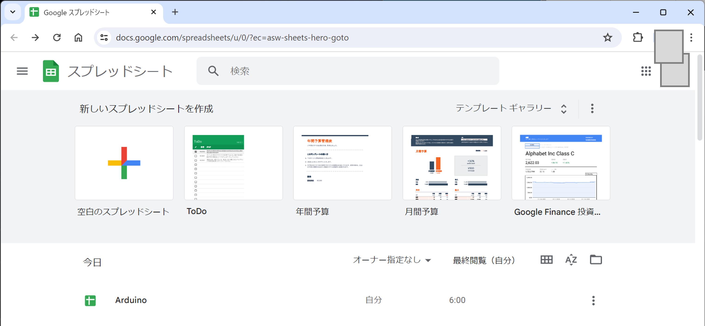
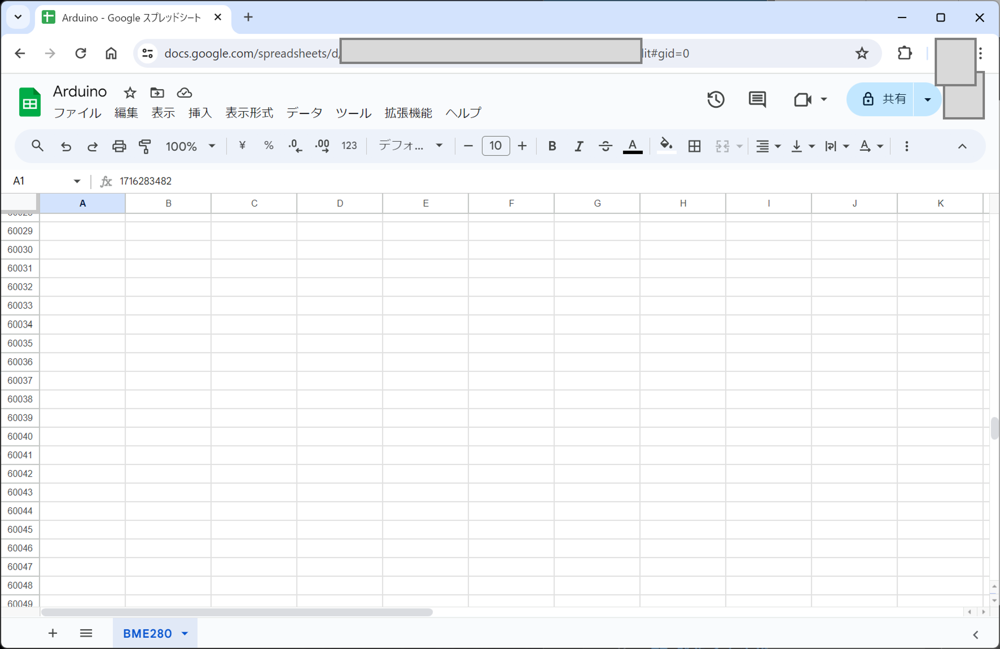
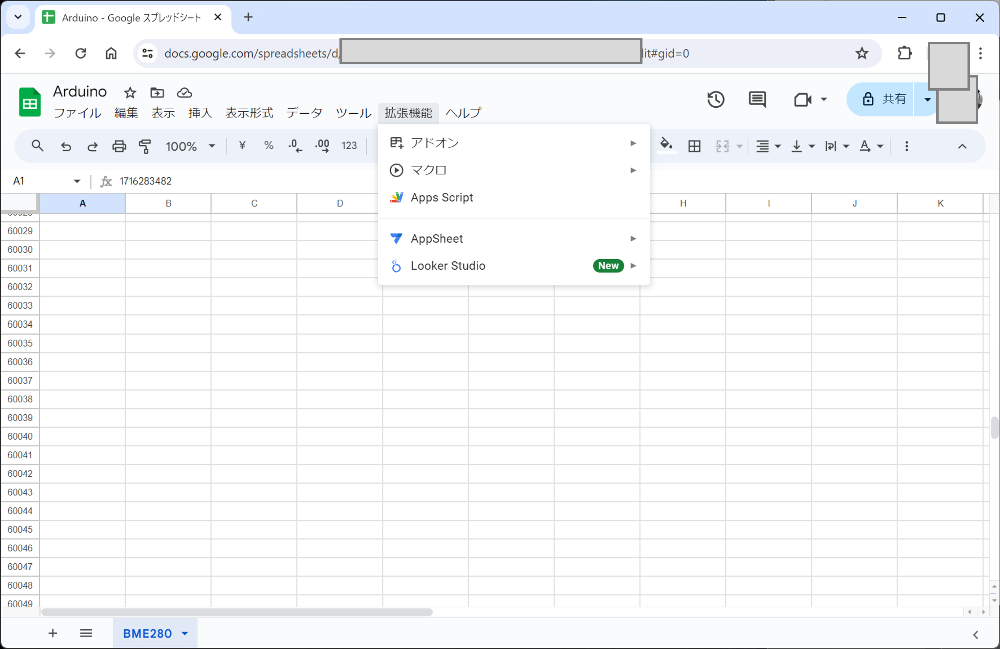
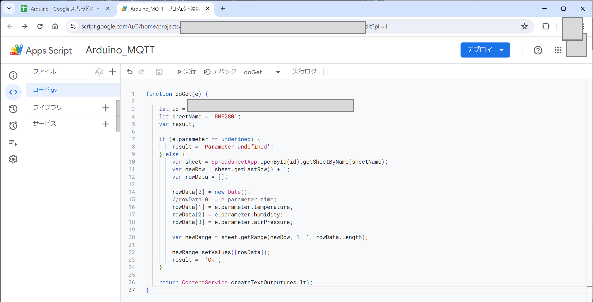
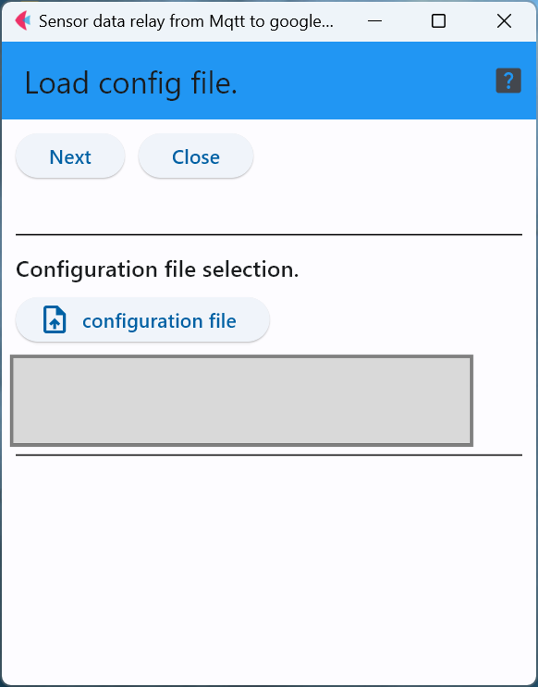
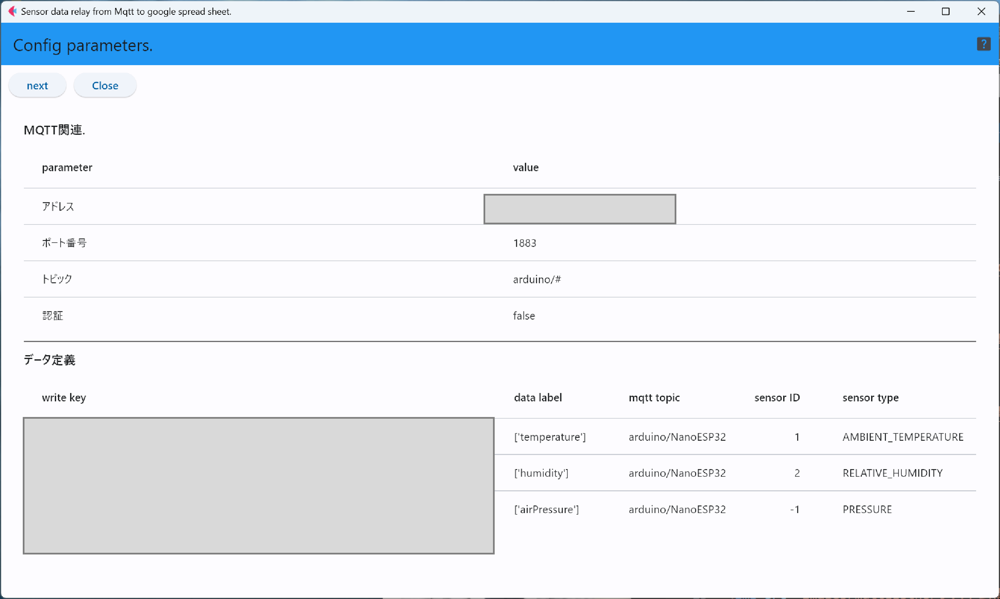
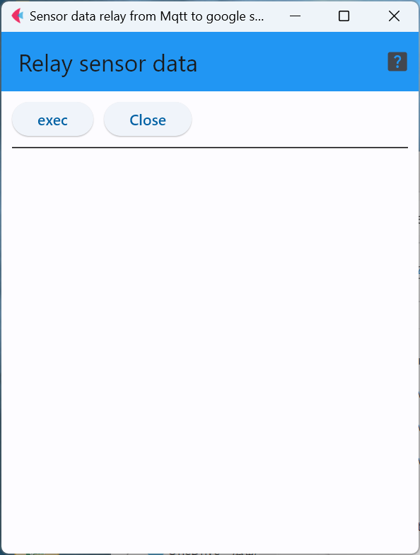

# mqttToGoogleSP

このプログラムは，MQTTブローカからセンサデータを取得し，設定ファイルで指定されたデータをGoogle App Scriptと連携して，Googleスプレッドシートに書き込む．

以後の説明は，気圧・湿度・温度センサ(BME280)を装備したセンサ端末のデータを取り扱う場合となる．


## 1. Google環境の準備

### 1.1. Googleスプレッドシートの準備

最初にGoogleスプレッドシートのトップページで新しいスプレッドシートを作る．
<div style="text-align: center;">

</div>

次に，スプレッドシートのシートに名前をつける．今回はセンサ(BME280)と同じにしている．
<div style="text-align: center;">

</div>

作成したスプレッドシートに，Google App Scriptを結びつけるため，「拡張機能」メニューで「App Script」を選択する．
<div style="text-align: center;">

</div>

開いたApp Scriptの画面でこのスクリプトに適当な名前(この例では「Arduino_MQTT」)を付ける．
<div style="text-align: center;">

</div>

以下のスクリプトはRestAPIで温度・湿度・気圧と時刻情報をスプレッドシートに書き込むことを可能にする事例である．
```
function doGet(e) {

    let id = 'aaaaaaaaaaaaaaaaaaaaaaaaaaaaa';
    let sheetName = 'BME280';
    var result;

    if (e.parameter == undefined) {
        result = 'Parameter undefined';
    } else {
        var sheet = SpreadsheetApp.openById(id).getSheetByName(sheetName);
        var newRow = sheet.getLastRow() + 1;
        var rowData = [];

        rowData[0] = new Date();
        //rowData[0] = e.parameter.time;
        rowData[1] = e.parameter.temperature;
        rowData[2] = e.parameter.humidity;
        rowData[3] = e.parameter.airPressure;

        var newRange = sheet.getRange(newRow, 1, 1, rowData.length);

        newRange.setValues([rowData]);
        result =  'Ok';
    }

    return ContentService.createTextOutput(result);
}
```

以下の説明を参照して，スクリプトの作成が終了したら，スクリプトをデプロイする必要がある．
なお，本ソフトウェアは認証機能を搭載していないため，このスクリプトのAPIへのアクセスを
特定のユーザのみに制限してはいけない．


### 1.2. Google App Scriptの説明

#### a) IDとシート名
まず，App ScriptにスプレッドシートのIDとシート本体の名前(先に付けた名前:BME280)をスクリプトに書き込む．
シートの名前は自分で付けたはずなので，それを書き込むだけで良いが，シートのIDは[こちらの参考資料](https://gainoheya.com/goole-id-spread-sheet/)
を見てスプレッドシートのIDを探し，その値を書き込む．
```
let id = 'aaaaaaaaaaaaaaaaaaaaaaaaaaaaa';
let sheetName = 'BME280';
```

#### b) 時刻情報
測定データは時系列データであるため，スプレッドシートには測定値と時刻情報の組み合わせで書き込む必要がある．
この時，センサ端末の測定時間とアップロード時間が選択できる．この選択はApp Scriptの内容と，本ソフトウェアの設定ファイルへの定義で
実現する．

まず最初に，アップロード時刻を採用する場合，App Scriptは以下のように表の最初の列(0番目)に時刻情報を書き込む．
```
rowData[0] = new Date();
```
一方，センサ端末の測定時刻を採用する場合は，下のように記述する．
これは，センサから送られてくるデータのうち，「time」というラベルの値を時刻情報として採用することを意味する．
```
rowData[0] = e.parameter.time;
```

センサ端末の測定時刻を採用する場合は，センサ端末のRTCの時刻情報が正確でなければならないため，運用に注意が必要．

#### c) データの種類と変数名
次に，センサデータの各値(気温，湿度，気圧)に関する定義を行う．
下の例は表の2番目の列から順に「気温」「湿度」「気圧」の順に保存する事例となっている．

```
rowData[1] = e.parameter.temperature;
rowData[2] = e.parameter.humidity;
rowData[3] = e.parameter.airPressure;
```

ここで，気温や湿度に対応する名前``temperature``や``humidity``に何かの規定があるわけではなく，
好きな名前を付ければ良い．ただし，付けた名前は，本ソフトウェア用の設定ファイル(yaml形式)の
内容と一致していなければならない．


## 2. 設定ファイルの内容
GoogleスプレッドシートとApp Scriptの作成が終了したら次に，本ソフトウェアの定義ファイル(yaml形式)を作成する．
この際，defineMqttToCloudを用いるか，自分でyaml形式のファイルを準備する．

以下は，BME280を使う事例となっている．

```
mqtt:
  address: 1.2.3.4 # MQTTブローカアドレス
  port: 1883 # MQTTブローカポート番号
  topic: arduino/hello # MQTTトピック
  auth: False # True 認証する, False 認証しない
  user:  # MQTT認証ユーザ名
  pass:  # MQTT認証パスフレーズ
  timeout: 60
google:
  time_stamp: 0 # 0以外 - センサ端末観測時刻
mapping:
 - { key: aaaaaaaaaaaaaaaaaaaaaaaaaaaaa, label: [temperature], topic: arduino/NanoESP32, sensorID: 1, sensorType: AMBIENT_TEMPERATURE }
 - { key: aaaaaaaaaaaaaaaaaaaaaaaaaaaaa, label: [humidity], topic: arduino/NanoESP32, sensorID: 2, sensorType: RELATIVE_HUMIDITY }
 - { key: aaaaaaaaaaaaaaaaaaaaaaaaaaaaa, label: [airPressure], topic: arduino/NanoESP32, sensorID: -1, sensorType: PRESSURE }
```

まず，mqttブローカ関連のパラメータ(``mqtt``)は全て(IPアドレス等)修正しておく．

### 2.1. google関連
App Scriptを作成する際に，時刻情報として端末の観測時刻とアップロード時刻のどちらを使うか決めたはずなので，それに従って
``time_stamp``の値を書き込む．

0の場合は，アップロード時刻を用い，0以外の場合はセンサ端末の観測時間が利用される．

```
google:
  time_stamp: 0 # 0以外 - センサ端末観測時刻
```

### 2.2. データの対応関係
上で定義したApp Scriptに対応する設定ファイルの内容は以下の通りである．
```
mapping:
 - { key: aaaaaaaaaaaaaaaaaaaaaaaaaaaaa, label: [temperature], topic: arduino/NanoESP32, sensorID: 1, sensorType: AMBIENT_TEMPERATURE }
 - { key: aaaaaaaaaaaaaaaaaaaaaaaaaaaaa, label: [humidity], topic: arduino/NanoESP32, sensorID: 2, sensorType: RELATIVE_HUMIDITY }
 - { key: aaaaaaaaaaaaaaaaaaaaaaaaaaaaa, label: [airPressure], topic: arduino/NanoESP32, sensorID: -1, sensorType: PRESSURE }
```

まず，「``key``」欄の値はスプレッドシートIDを書き込む．また，「``label``」は気温，湿度，気圧のScriptでの名前に合わせたものを書き込む．

最後に，センサの種類を``sensorType``に定義するが，この定義は以下の表の値を用いる．

|文字列|センサの種類|データ数|
|---|---|---|
| ACCELEROMETER | 3軸加速度 |3(x/y/z)|
| GYROSCOPE | 3軸ジャイロ |3(x/y/z)|
| LIGHT | 光センサ |1|
| PRESSURE | 気圧センサ |1|
| PROXIMITY | 近接センサ |1|
| LINEAR_ACCELERATION | 加速度センサ |(x/y/z)|
| ROTATION_VECTOR | 回転ベクトル センサー |1|
| RELATIVE_HUMIDITY | 湿度 |1|
| AMBIENT_TEMPERATURE | 気温 |1|
| CURRENT | 電流 |1|
| COLOR | 色彩センサ |4 (R/G/B/RGBA) |
| SIMPLE | 単純デジタルセンサ(0/1値) |1|
| ANGLE | 角度センサ |1|
| ONE_AXIS_GYRO | 1軸ジャイロ |1|
| DISTANCE | 距離 |1|
| DUST | ホコリセンサ |1|
| SPEED_KNOT | 速度(ノット) |1|
| POSITION | 位置 | 4(緯度/経度/高度/誤差)|
| SIMPLE_ANALOG | 単純アナログセンサ |1|

ここで，注意が必要なのは，3次元加速度センサや，色彩センサのように，値が1つではないものである．

この場合，``label``欄に対応する名前を配列形式で書き込む．
例えば，3軸加速度の場合``label: [x,y,z]``，色彩センサの場合``label:[r,g,b,rgba]``のように，
センサの値に対応する名前を配列に並べる．

## 3. アプリの操作

### 3.1. 設定ファイルのロード
まず最初に，作成した設定を記述したyamlファイルを読み込ませる．

「configuration file」ボタンでyamlファイルを指定し，「Next」ボタンで読み込ませる．

<div style="text-align: center;">

</div>

### 3.2. 設定情報の確認
この画面では，読み込ませた設定ファイルの内容が表示されるため，
問題がなければ「Next」ボタンをクリック．もし，問題があれば「Close」ボタンで
アプリを終了し，yamlファイルを修正する．

<div style="text-align: center;">

</div>

### 3.3. センサデータ中継
この画面が表示された状態で「exec」ボタンをクリックすることで，データの中継が開始される．中継対象となったデータは1データ1行の形で画面に表示される．


<div style="text-align: center;">

</div>


***
- [READMEに戻る](README.md)

