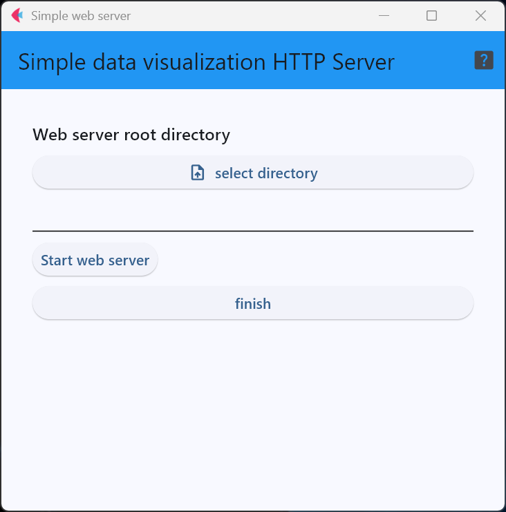
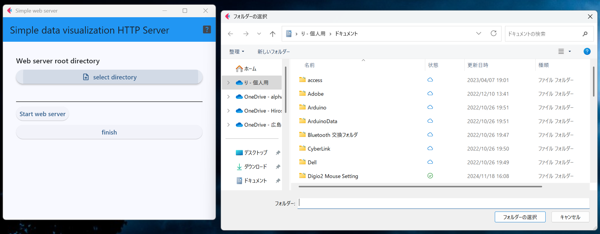
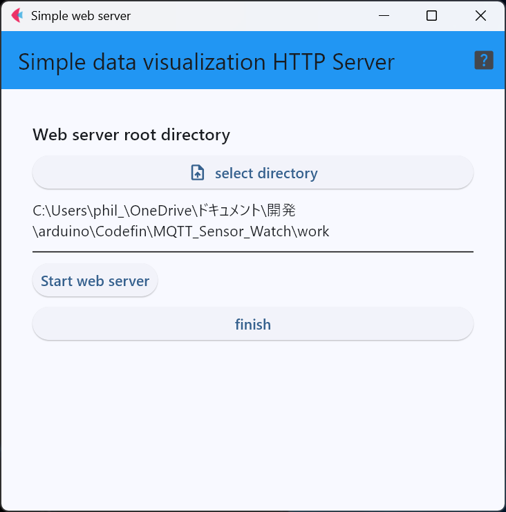
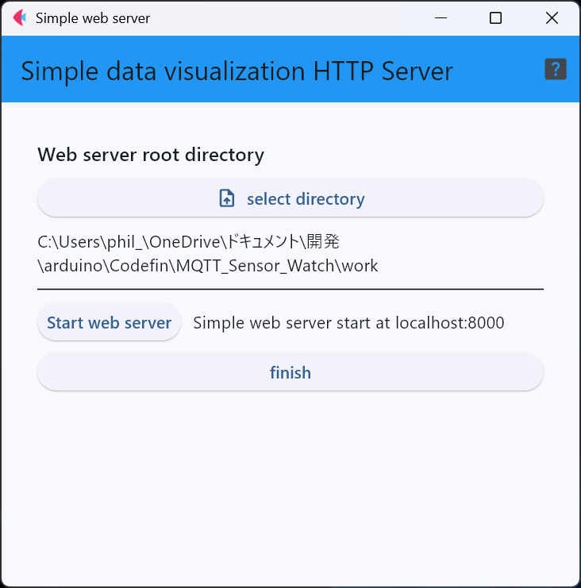
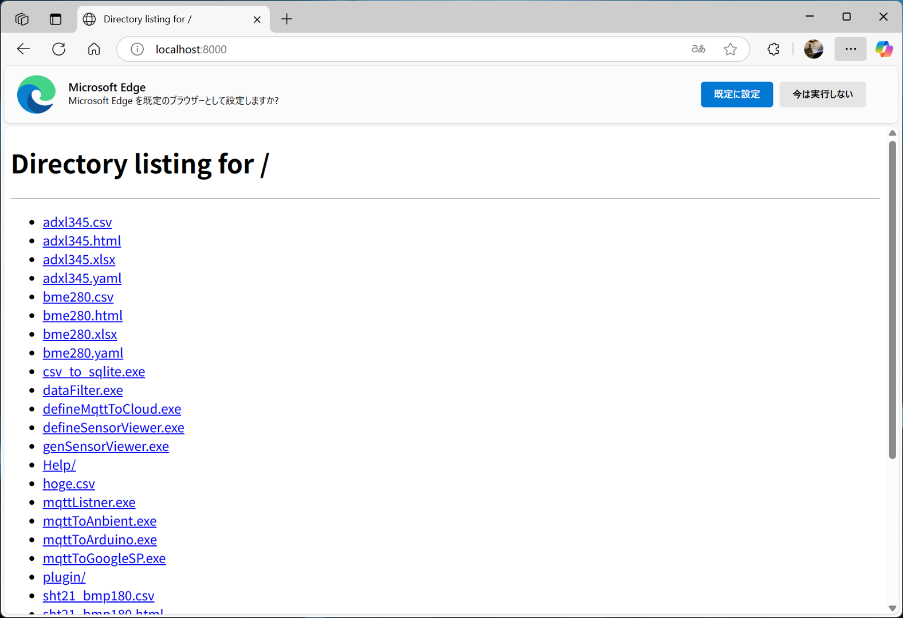
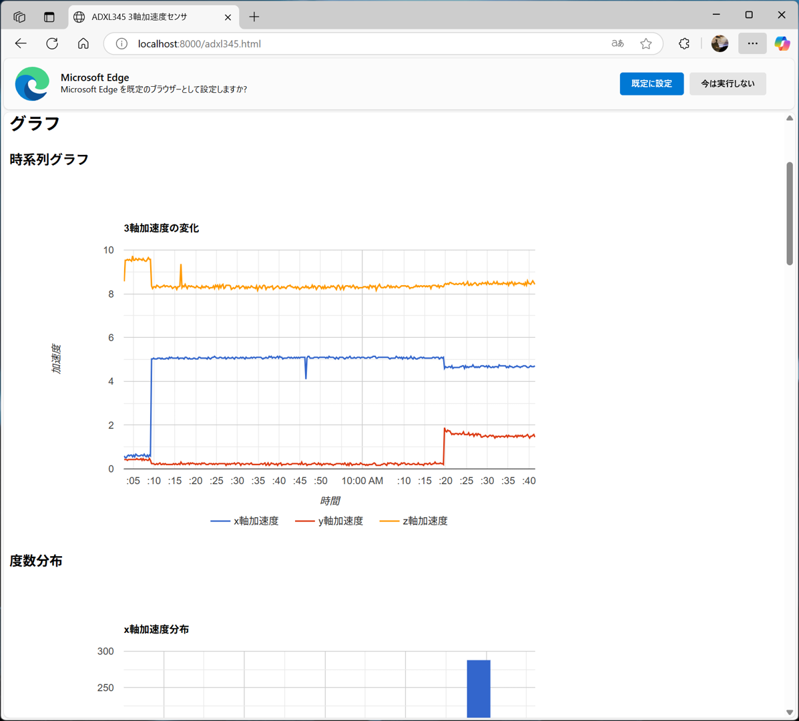
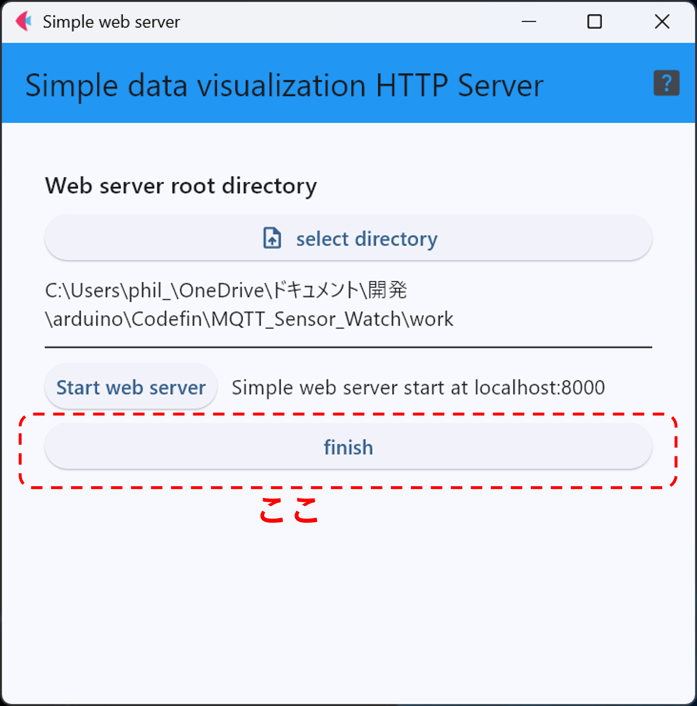

# webServer : シンプルなwebサーバ

webServerは，データとデータ可視化用に生成されたHTMLファイルを手元のPCだけで閲覧するために
使うシンプルなwebサーバプログラム．

下図のような1つの画面で全てが完結する．

## 1. Webサーバドキュメントルートの指定
可視化対象のデータと，データを表示するために作成(生成)したHTMLを1つのディレクトリに置き，
そのディレクトリをWebサーバに設定する．

下図のように，「select directory」ボタンを押すと，エクスプローラのダイアログが
開くので，データとHTMLが置かれているディレクトリを選択する．

選択の結果は，「select directory」ボタンの下に表示される．

## 2. Webサーバの実行
下図の「Start web server」ボタンを押すことで，webサーバが動作を開始し，同時にブラウザが起動する．

サーバのURLは「http://localhost:8000/」であり，下図のように，「Start web server」ボタンの横に表示される．

## 3. ブラウザでのアクセス
サーバ動作開始時に起動したブラウザは「http://localhost:8000/」にアクセスする．
下図のように
データや可視化用のHTMLが置かれているディレクトリに，index.htmlが存在しない場合は，
ディレクトリのリストが表示される．

ブラウザを閉じてしまった場合は，自分でブラウザを起動し，「http://localhost:8000/」にアクセスすること．

## 4. データの可視化

データの可視化を行うHTMLを選択すると，下のようにデータが可視化される．

## 5. アプリケーションの終了

下図に示すように「finish」ボタンを押すことで，
アプリケーションは終了する．

***
- [READMEに戻る](README.md)

