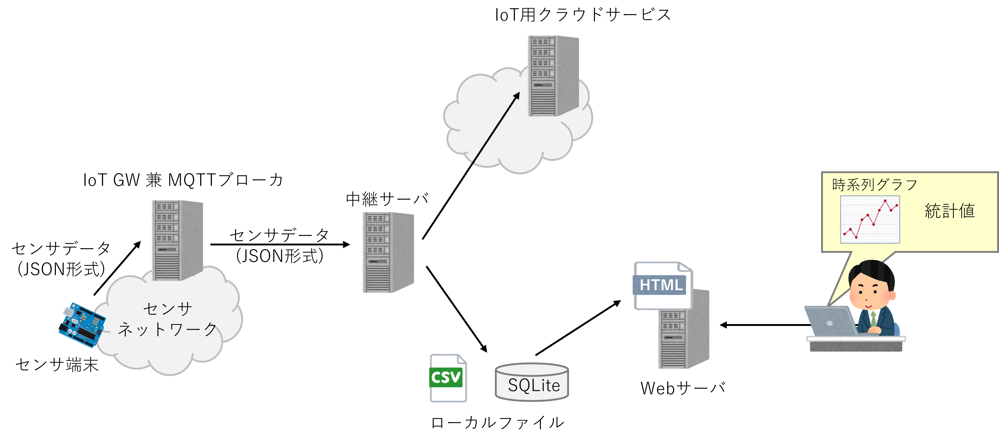
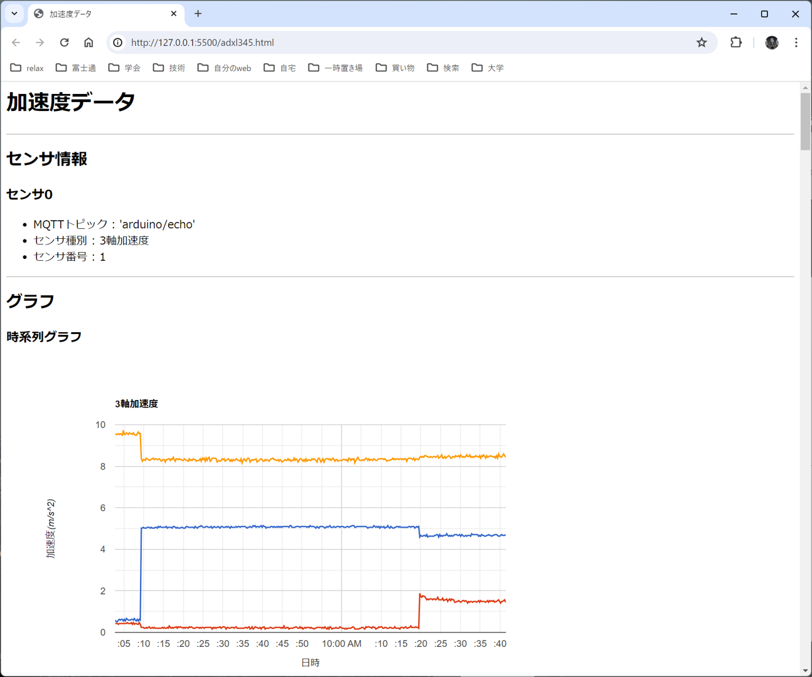
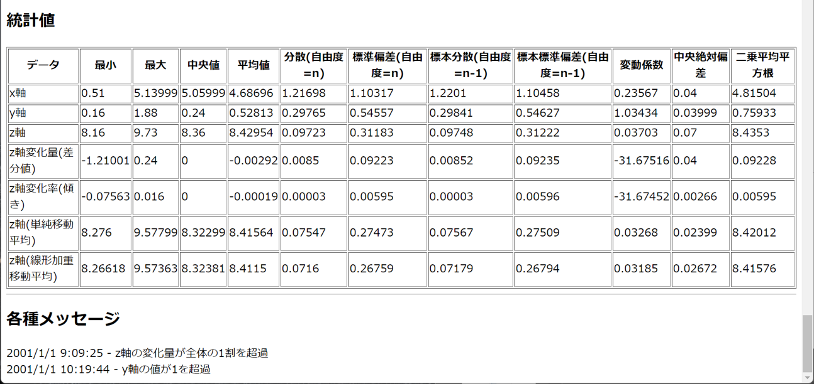

# mqtt_sensor_watch

このプログラム群は，[MQTT_Sensor_Generator](https://github.com/Cogefin/MQTT_Sensor_Generator)で生成されたArduino用プログラムで
動作する，Arduinoを使ったセンサ端末が発信するセンサデータを可視化するためのものである．

プログラム群は大きく分けて，MQTTブローカから取得したセンサデータをローカルに保存し，自前のwebサーバで可視化するものと，
MQTTブローカから取得したデータをクラウドサービス(Arduino Cloud等)にアップロードするものに分けられる．

<div style="text-align: center;">

</div>

また，ローカルで可視化するために必要なHTML(+Javascript)ファイルを合成するプログラムも含まれている．

ローカルでの可視化で用いるWebページでは，下図のようやセンサデータの時系列グラフや度数分布のグラフ，統計値(中央値，平均値等)や複数のセンサデータ(例えば気温と湿度)の間の相関係数を自動的に計算して表示することができる．

<div style="text-align: center;">

</div>

下の図は3次元加速度センサのデータに対する統計情報の表と観測値がある基準を超えた場合に警告を出す機能の出力例である．
<div style="text-align: center;">

</div>


## 対象環境と事前のソフトウェアインストール

動作環境はWindows, Mac, Linuxに限定しないものの，Windowシステムが動作している必要があるため，Linuxユーザは要注意．
また，本プログラム群はPython, Pythonのウィンドウシステム用のライブラリとSQLite3を利用しているため，
これらをインストールする必要があります．

最初にPythonおよびSQLite3をインストールしてください．

### 利用しているPythonライブラリ

以下のライブラリを使っている．
- sqlite3
- csv
- flet_multi_page
- flet
- yaml
- time
- re
- enum
- sys
- os
- paho.mqtt
- json
- datetime
- requests
- ambient
  
上のリストの最後の2つはセンサデータをクラウドサービスにアップロードするために用いるものであるため，
ローカルでの可視化しか行わない場合は，インストールする必要はない．``requests``はGoogleスプレッドシートに
アップロードするためのもので，``anbient``は「IoT可視化サービス(https://ambidata.io/)」にアップロードするための
ライブラリである．なお，``anbient``ライブラリは[ここ](https://ambidata.io/refs/python/)を参照してインストールする必要がある．

以下のプログラムを自分のPython環境で実行し，エラーが出なければ大丈夫ですが，
インストールしていないライブラリがあれば，エラーがでるので，pipやanacondaでエラーが無くなるまで
必要なライブラリをインストールすること．
```
import sqlite3
import csv
import flet_multi_page
import flet
import yaml
import time
import re
import enum
import sys
import os
import paho.mqtt
import json
import datetime
import requests
import ambient
```


## インストール

ダウンロードしたアーカイブをほどいて，どこかのディレクトリに丸ごとコピー(もしくは移動)するだけで大丈夫です．

### Widowsの場合

アーカイブの解凍以外にすべきことはありません．


### MacやLinuxの場合
shell画面でアーカイブを解いたディレクトリに移動し，以下のコマンドを入力してください．

```
$ chmod +x csv_to_sqlite dataFilter defineSensorViewer genSensorViewer mqttListner sqlite_to_csv mqttToAnbient mqttToArduino mqttToGoogleSP
```


## 実行方法

Windowsの場合は，各コマンドに対応したバッチファイルが存在するので，それをダブルクリックすればOKです．

MacやLinuxの場合は，下のように，shell画面で直接実行してください．


```
$ ./csv_to_sqlite
```

## 詳細情報
個別のソフトウェアの詳細は「Doc」ディレクトリ内の各ドキュメントを参照のこと．
